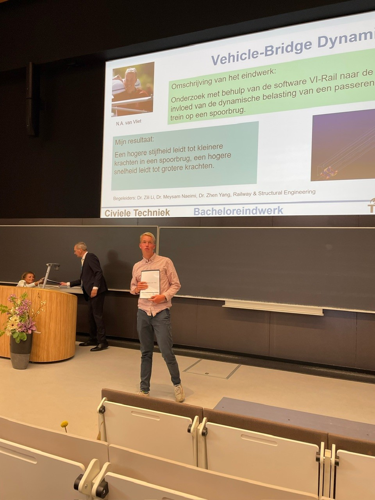
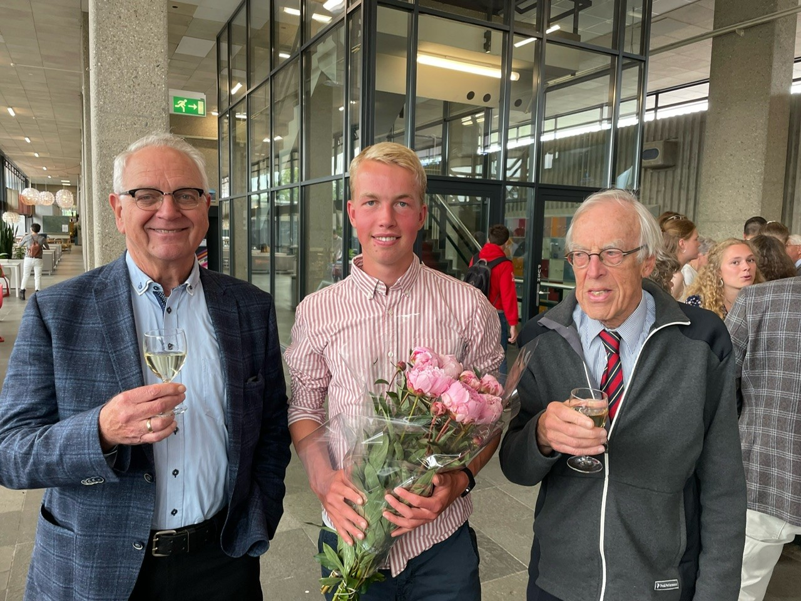

# BSc Civil Engineering

```{figure} Figures/BSc_diploma.jpg
---
name: BSc_diploma
align: right
scale: 20%
---
Me with my BSc diploma  
after the awards ceremony
```

As a BSc student in Civil Engineering at TU Delft, I followed a diverse and challenging curriculum that combined technical depth with practical application. The first two years ({ref}`BSc_jaar1en2`) were structured into ten-week periods, during which I took courses in mathemics, mechanics, application courses and practicals with software and programming in Python. I developed strong analytical skills and learned how to use software tools for modeling and creating 3D technical drawings.

```{figure} Figures/BSc_curriculum_jaar1en2.jpg
---
name: BSc_jaar1en2
width: 95%
align: center
---
BSc curriculum year 1 and 2
```

In my third year ({ref}`BSc_jaar_3`), I had the opportunity to explore a minor, allowing me to broaden my knowledge depending on my interests. I then selected elective courses that aligned with my personal and professional goals. As I liked the structural mechanics courses most, and I knew that I wanted to follow the track Structural Engineering in the MSc program, I choose Structural Mechanics 4. The program culminated in the Bachelor End Project (BEP), where I applied everything I had learned in a final research or design assignment, similar in nature to a high-level school research project. Upon completion, I earned the title Bachelor of Science (BSc), equipped with a solid foundation in civil engineering and a wide set of academic and professional skills.

```{figure} Figures/BSc_curriculum_jaar3.jpg
---
name: BSc_jaar_3
width: 95%
align: center
---
BSc curriculum year 3
```

## Minor: Engineering for Large-Scale Energy Conversion and Storage (ELECS)
I choose this minor as I was interested in large energy systems and renewable energies.   
Read about it here... {ref}`Minor`

## Electives
- Structural Mechanics 4 (CTB3330)
- Hydraulic Structures (CTB3355)
- Water Systems Analysis (CTB3360)

## Bachelor End Project (BEP)
I choose the following subject for my BEP:  
**Vehicle-bridge dynamics**  
_Theoretical modelling and numerical simulation of vehicle-bridge dynamics using VI-Rail_  
Read about it here... {ref}`BEP`

<div style="display: flex; justify-content: space-around;">
  <figure style="text-align: center; width: 45%;">
    
    <figcaption>Presenting my BEP</figcaption>
  </figure>
  <figure style="text-align: center; width: 45%;">
    
    <figcaption>Celebrating finishing my BSc with my grandfathers during the graduation ceremony</figcaption>
  </figure>
</div>
