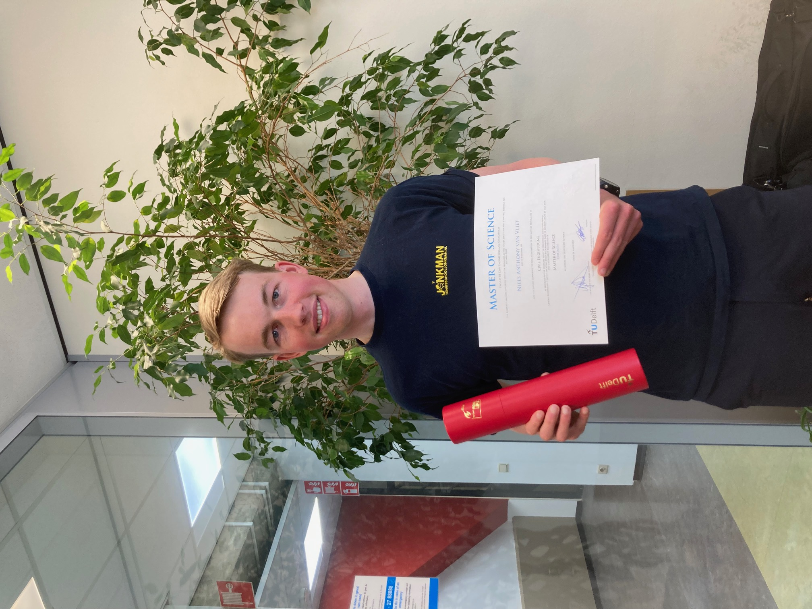

# MSc Civil Engineering

I chose to pursue the MSc Civil Engineering at TU Delft as a natural continuation of my BSc. I had greatly enjoyed my bachelor studies, and TU Delft’s strong global reputation in Civil and Structural Engineering made it the ideal choice. On March 28, 2025, I proudly graduated *cum laude*.

<div style="display: flex; justify-content: space-around;">
  <figure style="text-align: center; width: 45%;">
    
    <figcaption>Me with my family after presenting my MSc Thesis🎓</figcaption>
  </figure>
  <figure style="text-align: center; width: 45%;">
    
    <figcaption>Me with my diploma in my office at the CEG faculty</figcaption>
  </figure>
</div>

```{Admonition} About MSc Civil Engineering at TU Delft
class: dropdown, note
---
"TU Delft is a world leading university in Civil Engineering and executes ground breaking research into these challenges. Our research findings and innovations are fed into the educational programme so you are trained to think at a high academic level. This provides you with the necessary scientific and engineering skills to work in multidisciplinary teams of professionals that create responsible solutions to today’s engineering challenges."  
([TU Delft website](https://www.tudelft.nl/en/education/programmes/masters/cie/msc-civil-engineering), 2025)
---
```

---

## Track Structural Engineering

I chose the Structural Engineering track because of my strong interest in the structural courses during my BSc. My passion lies in understanding how forces flow through structures and how small design choices can have large impacts. This track offered me a solid foundation in advanced mechanics and design, equipping me to solve complex engineering challenges.

```{figure} Figures/MSc_curriculum_year1and2.jpg
---
name: MSc_year1and2
width: 95%
align: center
---
MSc Structural Engineering curriculum – Year 1 and 2
```

---

### 🧱 Core Modules
```{admonition} Programme Base: Civil Engineering
:class: dropdown

Parallel to this faculty wide module, the first semester includes a module specifically for all Civil Engineering students, focusing on advanced mechanics and interdisciplinary perspectives. It provides a solid basis for all six tracks of the programme, each of which offers a balanced combination of in-depth and broadly oriented knowledge and skills.
```

```{admonition} MUDE
:class: dropdown

The first year of the MSc Civil Engineering starts with the faculty module on Modelling, Uncertainty and Data for Engineers (MUDE). This module takes place in Q1 and Q2 and is shared with Earth, Climate and Technology and Environmental Engineering master students.

In a typical week you will be introduced to new theory, practice it on your own through a series of exercises and work on real data sets and models together with teachers and classmates in a medium-sized classroom setting. At the end of each week you will apply these concepts in a project along with a group of fellow students. You will also have weekly coding assignments to build your programming skills in a way that will help you apply the methods learned in MUDE, as well as prepare you for your future MSc thesis work.
```

```{admonition} Track Base Module: Structural Engineering
:class: dropdown

Structural Engineering (CIEM 5000) is the base module for the track. It continues the learning line on modelling, data monitoring, sensing, and uncertainty and risk analysis from the Faculty Base Module. It emphasizes modelling structures, understanding mechanical properties, and applying experimental results. It includes two units: 1) Sustainable Construction Members and Systems focuses on sustainable design and materials like steel, timber, and concrete, 2) Mechanics of Slender Structures deals with the fundamental behaviour and design of one- and two-dimensional slender structures. You will gain skills in designing, analysing, and optimizing various structural systems while integrating principles in sustainability and circularity. The module takes place over Q2 and Q3.  
```

```{admonition} A-module: Structural Mechanics and Dynamics (CIEM5110)
:class: dropdown

This module provided advanced knowledge in structural mechanics and dynamics. I learned to analyse structural stability under static and dynamic loads using computational tools like FEM, and to interpret vibration measurements. The course bridged theoretical modeling with practical applications, including lab experiments.
```

```{admonition} B-module: Applied Mechanics of Structures (CIEM5210)
:class: dropdown

This module deepened my understanding of the mechanical behavior of structures. I applied analytical and computational techniques to model complex systems and evaluate structural response. This course laid the groundwork for academic research and provided the tools to become an applied mechanics specialist.
```

---

### 🎯 Electives

Some of the electives I took during my MSc:

- **CO₂ Neutral Structures (CIEM5304)**
- **Fire Safety Design (CIEM5305)**
- **Parametric Design and Digital Fabrication (CIEM5308)**

These courses allowed me to explore sustainability, safety, and digital innovation in the context of structural engineering.

---

### 🔍 Cross-over Module: Data Science & AI for Engineers

As part of my MSc, I followed the interdisciplinary module **Data Science and Artificial Intelligence for Engineers (CEGM2003)**, where I explored how AI and data science can be applied to complex civil engineering problems. From probabilistic modeling to deep learning, we tackled real-world case studies and collaborated across different tracks.  
📄 Read more: {ref}`DSAIE`

---

## MSc Thesis

I already knew before my MSc Thesis started that I would continue with a PhD at TU Delft, specializing in multifunctional quay walls in Amsterdam. Therefore, I used my thesis to build a solid technical foundation in this topic.

**Title:** *Structural assessment of inner-city quay walls’ capacity to resist multifunctional loads*  
**Summary:** FEM analysis of a traditional quay wall and a sheet pile wall to assess their capacity for current and future multifunctional loads.

📄 Read more: {ref}`MSc Thesis`

```{Admonition} What came next?
:class: note
After completing my MSc, I began a PhD at TU Delft focused on the multifunctional structural behavior of quay walls in Amsterdam — directly continuing from the research started in my thesis.
```
