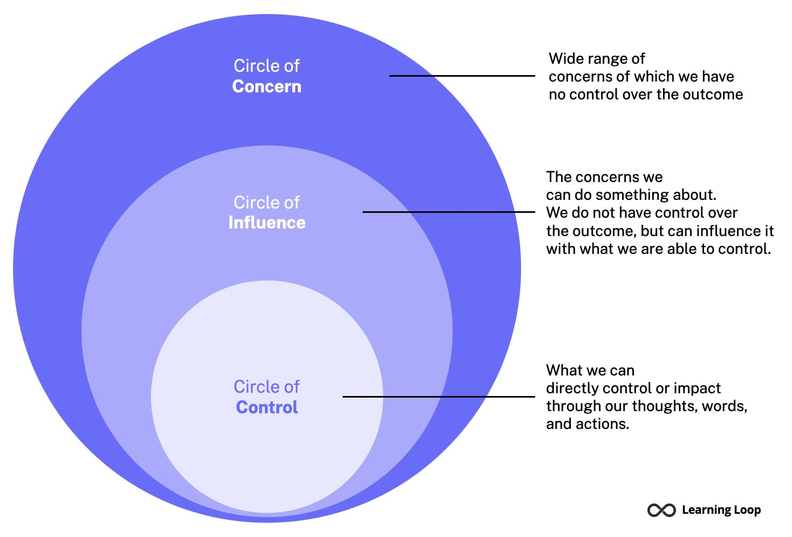
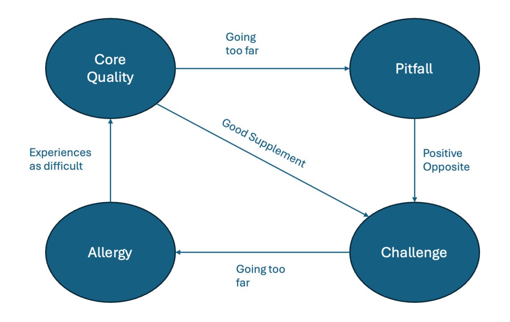
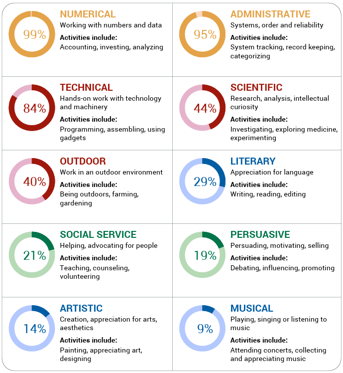
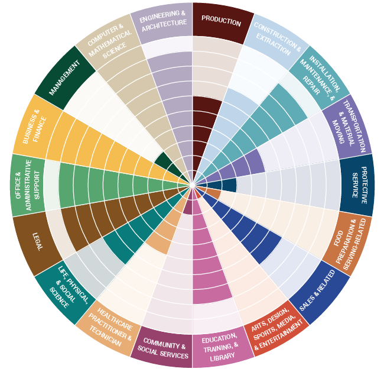
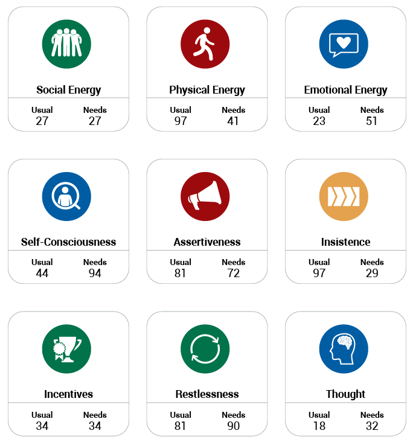
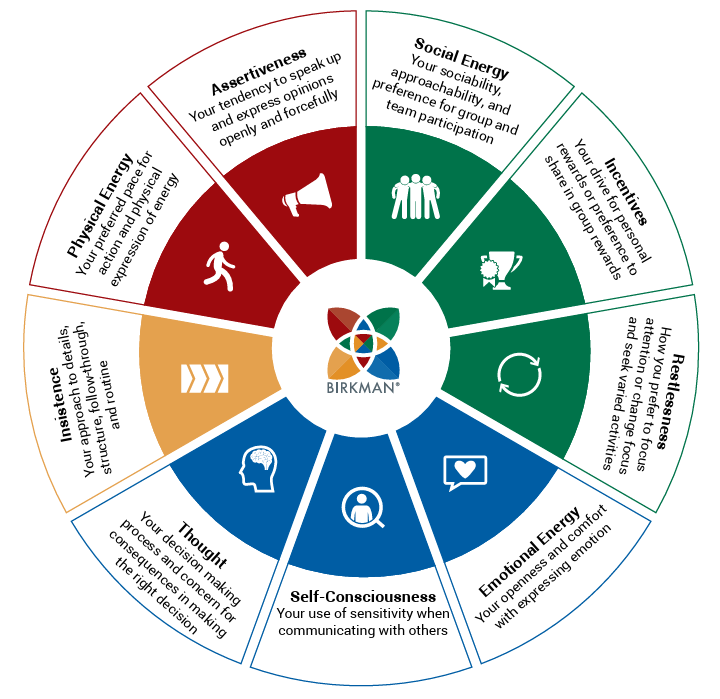

# Transferable skills
As a PhD candidate, it's easy to focus solely on developing deep expertise in your research field. However, succeeding in academia—or transitioning to roles beyond it—requires more than technical knowledge. That’s where transferable (soft) skills come in. These are essential, cross-disciplinary abilities like communication, collaboration, leadership, time management, and critical thinking. They help you navigate complex work environments, contribute effectively to teams, manage your own progress, and engage meaningfully with stakeholders inside and outside academia. To strengthen these competencies, I’ve participated in several courses as part of the PhD development program.


| Courses / Activities             | Start Date | End Date   | GS Credits |
|----------------------------------|------------|------------|------------|
| Social Safety Dialogue           | 2024-10-24 | 2024-10-24 | 0.5        |
| PhD Start-up                     | 2025-04-17 | 2025-06-17 | 2          |
| Mental Fitness Intervention Program | 2025-06-04 | 2025-06-25 | 1 |
| Popular Scientific Writing | 2025-06-05 | 2025-06-26 | 2 |
| Voice Training                   | 2025-06-23 | 2025-07-07 | 1.5          |
| LinkedIn for Researchers         | 2025-06-25 | 2025-07-23 | 1          |
| Managing Myself, Leading Others  | 2025-07-02 | 2025-07-16 | 1.5          |
| Standing up For Yourself, While Keeping Good Relations  | 2025-07-04 | 2025-07-04 | 1          | 
| Scientific Storytelling          | 2025-07-10 | 2025-07-31 | 2 |
| Foundations of Education Design  | 2025-08-15 | 2025-08-15 | 1 |
| Assessing Students and Master Thesis Projects | 2025-09-05 | 2025-09-15 | 1 |

## Social Safety Dialogue
The Social Safety Dialogue organized for PhD students in the Engineering Structures department provided a valuable opportunity to openly discuss issues related to safety, respect, and well-being in the academic environment. As a PhD candidate, you often find yourself in a vulnerable and dependent position—relying on supervisors for guidance, resources, and career progression—making it difficult to speak up when boundaries are crossed or expectations become unclear or overwhelming.

This afternoon created space to share experiences, raise concerns, and reflect on what a safe and supportive work environment should look like. It also helped raise awareness among peers and staff about the challenges PhDs may face, and the importance of mutual respect, transparency, and clear communication. Engaging in such dialogues is a step toward a healthier academic culture where everyone feels heard and empowered to contribute to a constructive and inclusive research environment.

## PhD Start-up

### T4.G1 - AI | PhD Startup Module A-I: Introduction to the Graduate School
During the first interactive session (Module A-I), I shared my experiences, expectations, and initial questions regarding the start of my PhD trajectory. Together with other participants, I reflected on the challenges I’ve encountered so far and took a closer look at my current skillset and areas for development. We also discussed the roles and responsibilities within the supervisory team, which helped clarify expectations on both sides. A highlight of the session was the Q&A with senior peers, where I had the opportunity to ask candid and sometimes provocative questions in a confidential setting. Overall, it was a valuable and insightful start to the professional development programme.

### T4.G1 - AII | PhD Start-up Module A-II: Navigating the PhD life
This course helped me reflect on both the rewards and challenges of PhD life. I recognized that I’m motivated by learning, being paid to do learn and investigate things, feeling inspired, and the status that comes with the title. At the same time, I’ve become more aware of the mental load—especially the non-linear nature of research and the difficulty of switching off mentally.

<div style="display: flex; justify-content: space-around;">
  <figure style="text-align: center; width: 45%;">
    
    <figcaption>Circle of control</figcaption>
  </figure>
  <figure style="text-align: center; width: 45%;">
    
    <figcaption>Core quadrant model</figcaption>
  </figure>
</div>

Tools like the circle of control and the core quadrant model helped me better understand my strengths and pitfalls, such as being determined but sometimes impatient. I also learned how to give effective feedback, which I’ve already applied in improving communication with my supervisor. Overall, the course gave me practical strategies to navigate the human side of research more confidently.

### T4.G1 - AIII | PhD Start-up Module A-III: Conquering challenges
In this 3-hour Zoom session, I reflected on stress signals and coping strategies, shared experiences through the "game of unspoken things," and appreciated the positive aspects of my PhD environment. I learned that recognizing early signs of stress, like changes in sleep, eating, and social habits, can help me manage it better, and that it's normal to feel uncertain about research direction in the first year.

### T4.G1 - B | PhD Start-up Module B - Scientific Integrity
I learned to recognize and reflect on the ethical, societal, and professional responsibilities tied to conducting research. The course covered key topics such as data misconduct, fraud, plagiarism, and conflicts of interest, helping me understand both individual and systemic causes of scientific misconduct. I also became familiar with the integrity policies at TU Delft and in the Netherlands, and how to apply them in practice to promote responsible research and prevent misconduct.

```{dropdown} Story about scientific integrity: Schön scandal
The Schön scandal involved physicist Jan Hendrik Schön, who was found to have fabricated data in numerous high-profile scientific papers between 2000 and 2002. His fraudulent research, which claimed major breakthroughs in nanotechnology, was published in top journals but later retracted after investigations revealed repeated data manipulation. This case is a key example in scientific integrity courses, illustrating the importance of honesty, reproducibility, and ethical responsibility in research. It underscores how misconduct can damage scientific progress and erode public trust in science.
```

## T3.G15 | Mental Fitness Intervention Program
This course consisted of four one-hour sessions. The course is designed to support PhD candidates in building resilience, motivation, and self-leadership. While I didn’t find the content particularly impactful or applicable to my personal challenges, the sessions did offer a welcome break from daily academic pressures. They provided a relaxed setting and an easy way to earn credits, even if the overall benefit to my mental fitness was limited.

## T1.B4 | Popular Scientific Writing
This course consisting of four 3-hour sessions with homework. It focused on how to communicate complex research in a clear and accessible way for non-specialist audiences. I took it because I often noticed that people lose track when I explain my research, and I wanted to improve how I present my work.

Throughout the course, I learned the importance of choosing the right words for the target audience and how to make content more engaging. We discussed what makes writing interesting—such as new or unexpected information, rhythm, lively language, and a curious opening. I also learned a structured writing process: warm-up, sketch, write, and edit. The sessions included opportunities to collaborate and get feedback on our writing.

## T1.A6 | Voice Training
Sound plays a significant role in how we experience the world, and this includes the sound of our own voice. During the voice training course, I learned how to use my voice more effectively—speaking with clarity, variation, and projection, similar to singing but still natural. This approach helps maintain vocal strength and reach, even in larger spaces, while supporting clearer and more persuasive communication.

```{admonition} Learning objectives
- Support your voice with a good way of breathing 
- Speak with a continuous sound whilst saying a sentence or part of a sentence 
- Create resonance within yourself and in the space around you 
- Control the mood of your voice through the use of continuous or non-continuous sound and less or more resonance 
- Keep the listener attentive through variations in the way you speak, varying through the use of pauses, rhythm, intonation, speed, vowel length and volume. 
- Increase your volume through the use of resonance in the space around you
```

The course was by Gerben Tuin. More information can be found on his website [4Focus](https://www.gt-training.nl/).

## T1.F1 | LinkedIn for Researchers

## T2.D2 | Managing Myself, Leading Others
I took a course focused on increasing self-awareness and leadership insight using the Birkman report. The course provided a structured reflection on my personality traits, work styles, and stress behaviors. It helped me understand how these factors influence my leadership approach. Rather than teaching leadership skills, it offered a deeper understanding of my default settings. This insight supports more effective self-management and leadership.

<iframe 
width="560" 
height="315" src="https://www.youtube.com/embed/Nmuo-UXlK5o?si=PdGWuxx87Tfnht61" 
title="YouTube video player" 
frameborder="0" 
allow="accelerometer; autoplay; clipboard-write; encrypted-media; gyroscope; picture-in-picture; web-share" referrerpolicy="strict-origin-when-cross-origin" 
allowfullscreen>
</iframe>

I got an overview of my interest and career advice, highlighting my strong interests in numbers and technical information as an engineer. Also scoring high on the administrative side did not surprise me, as I really like to organize everything neatly, whether it is by building my own website to have an online CV, keeping a training log, organizing my calendar and to do lists or cleaning my house. Also my career advice I could clearly understand, as it showed my background in Engineering but also showed my interest in programming in for example this website. Furthermore, my interests in mathematics and numbers showed and with two parents with an education in finance, the interest to pursue a career in business and finance did not surprise me.

<div style="display: flex; justify-content: space-around;">
  <figure style="text-align: center; width: 45%;">
    
    <figcaption>Birkman interests</figcaption>
  </figure>
  <figure style="text-align: center; width: 45%;">
    
    <figcaption>Birkman career advice</figcaption>
  </figure>
</div>

Furthermore the Birkman components below reflected me well. I have a high **physical energy** and like things to be structured (**insistance**). Additionally, I can be **restless**, I would like to have something to do as I am a proactive person.

<div style="display: flex; justify-content: space-around;">
  <figure style="text-align: center; width: 45%;">
    
    <figcaption>Birkman components</figcaption>
  </figure>
  <figure style="text-align: center; width: 45%;">
    
    <figcaption>Birkman components explained</figcaption>
  </figure>
</div>

Overall, this course emphasized the fact that everyone is different and has different needs. I am really results oriented and tend to focus a lot on the content, and not as much on the relationship, whilst taking a good organisation for granted. Since this is not the case for everyone, this course helped me with initiating a good 'social contract'. By investing in the relationship and organization early on, even briefly, you archieve greater results in the content later. In conclusion this course learned me that by managing my own behaviour, I can more effectively collaborate or lead others.

## T2.C2 | Standing up For Yourself, While Keeping Good Relations
In this one-day course I learned the essentials of effective communication in relationships with power differences, such as those between a PhD candidate, supervisor and promotor. It clarified my understanding what it takes to get things done on a content level without harming the relationship and to increase my personal influence in the decision process.

```{admonition} Learning objectives
- Apply effective communication strategies and problem-solving skills with collegues, like setting boundaries and saying no. 
- Recognize how power differences influence relationships and the importance of long-term relationships. 
- Know how effective communication contributes to your preferred outcome on a content level. 
- Have a better understanding managing conflicts, including the use of constructive language. 
- Prepare a confrontation or negotiation, both on content as well as a relationship level. 
- Apply your body language and non-verbal factors in your advantage.
```

## T1.C1 | Scientific Storytelling

## T3.A1 | Foundations of Education Design

## T3.A3 | Assessing Students and Master Thesis Projects


