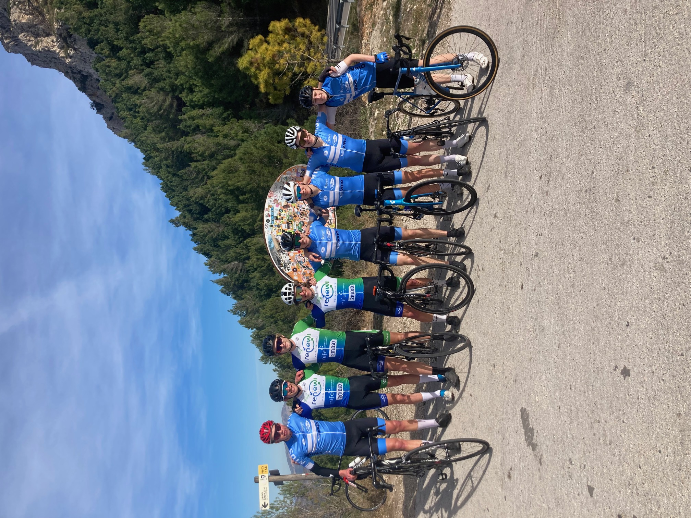
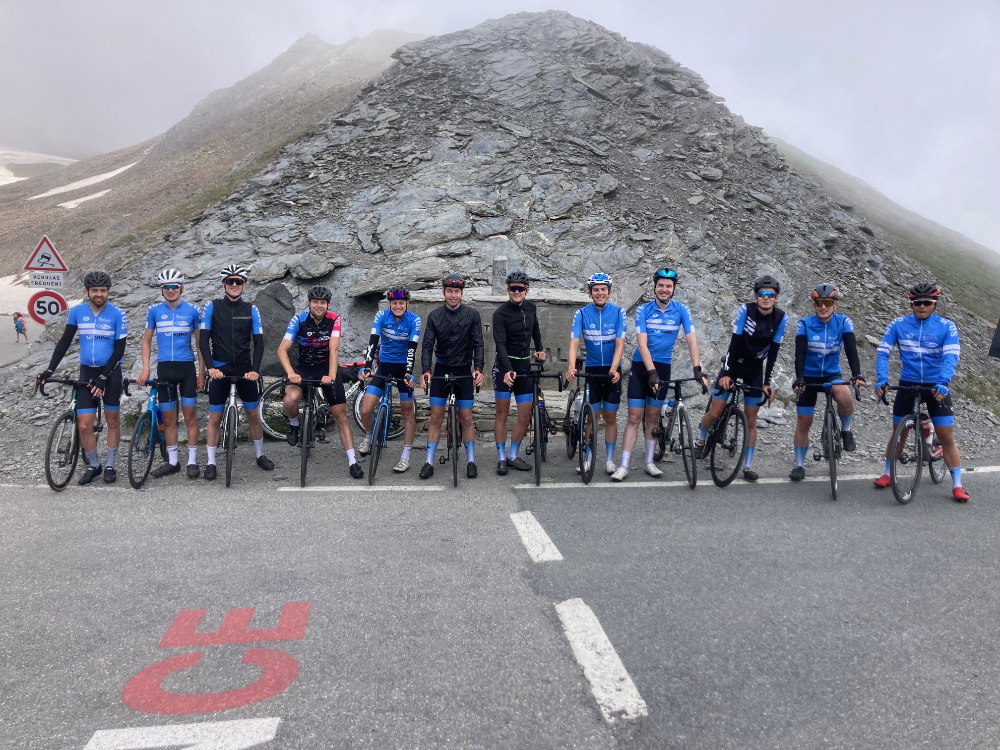
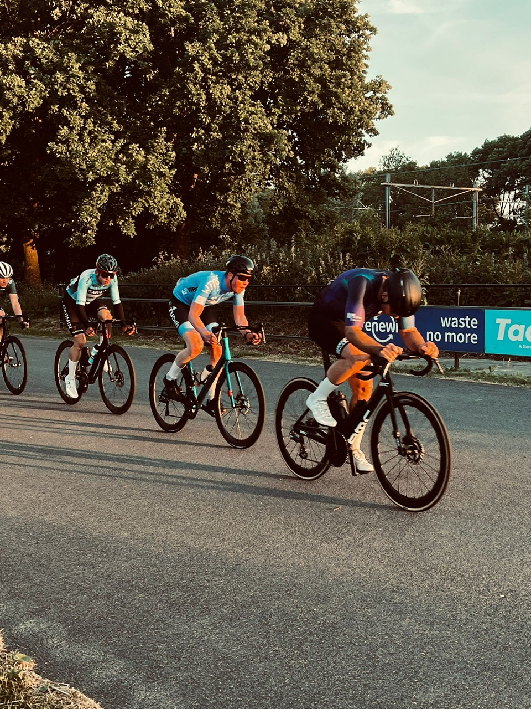
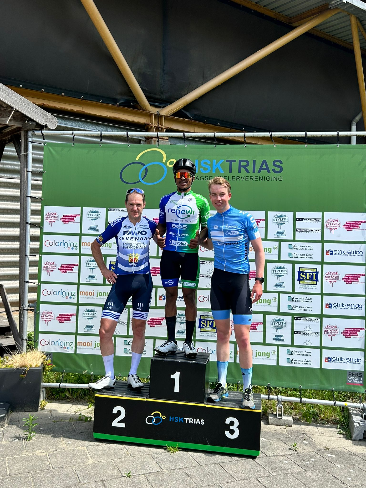
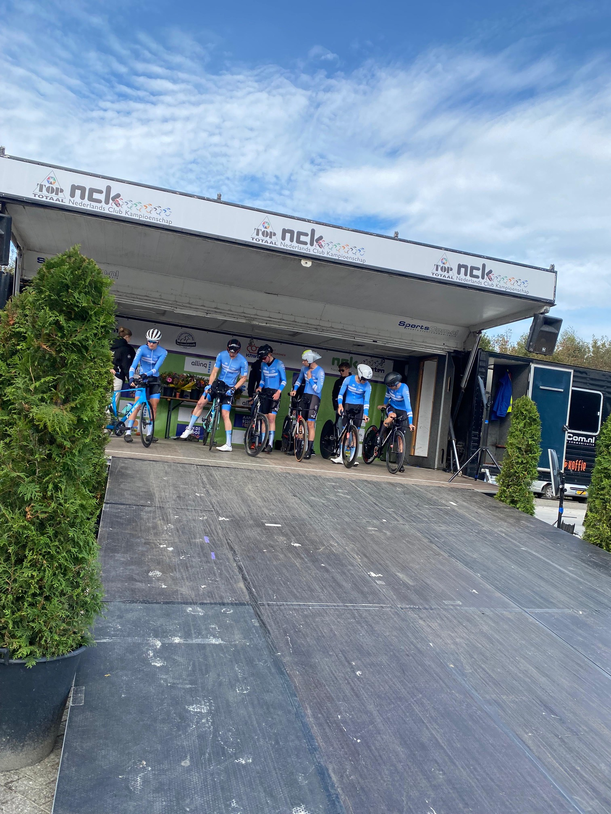
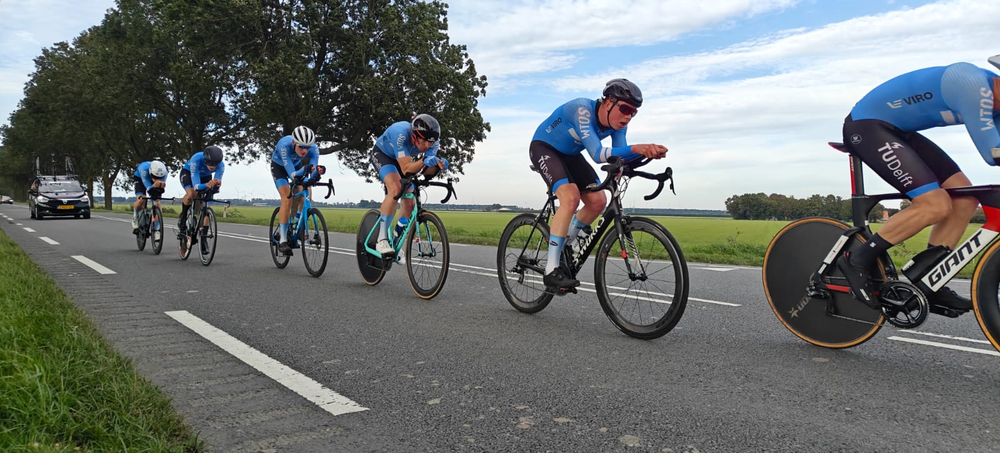
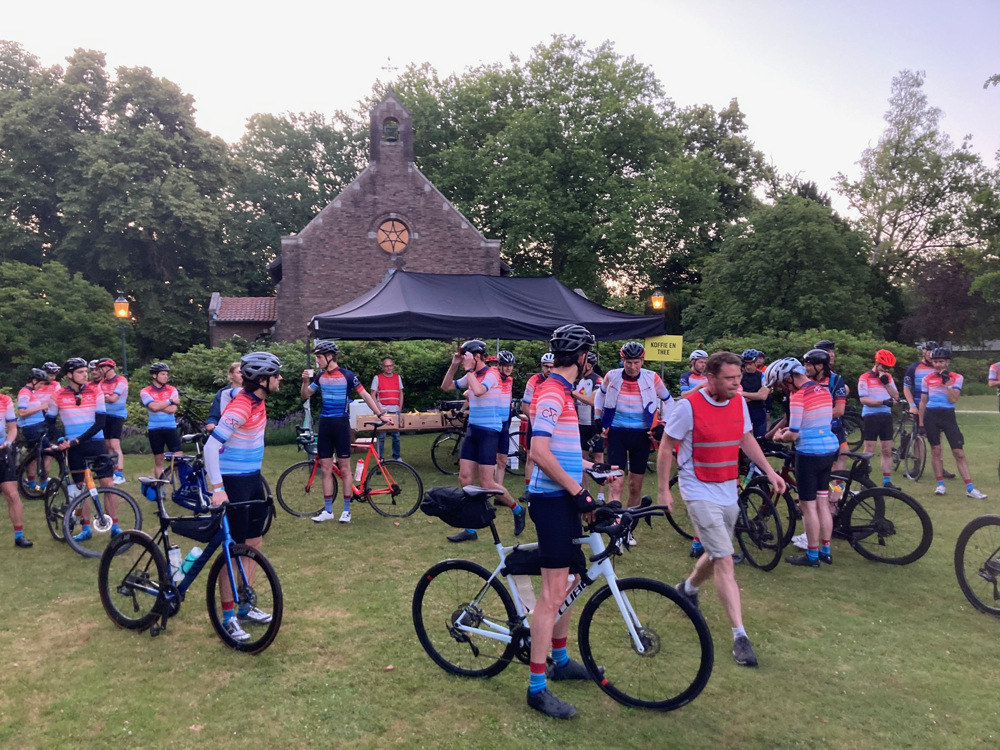
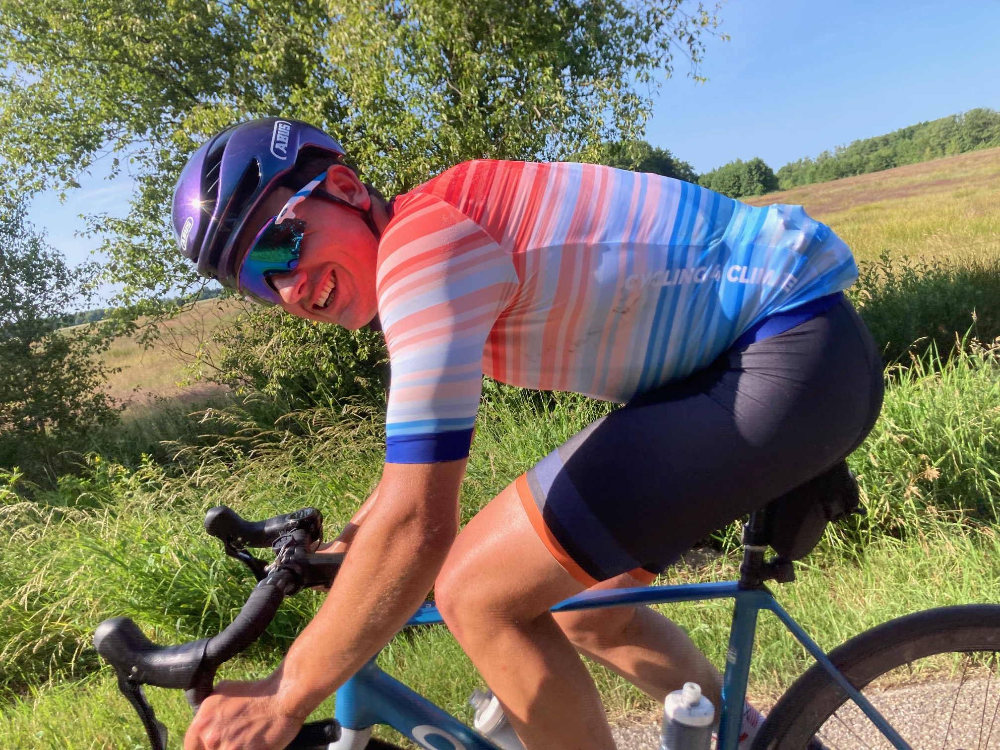

(Cycling)=
# Cycling

## Starting
I got my first bike when I was 12, as a gift from my holiday. From then on, I could go cycling with my dad. Later, I was even allowed to bring my bike on holidays, which meant tackling epic climbs—my first col being the Col d’Izoard. I also started going out for rides on my own.

Through ice skating, I met Alex and Michiel, who both also worked at Kras Sport. We began riding together, joined HSV de Kampioen, and started competing in the Sunday morning races there, as well as the Saturday afternoon competition at Sloten. Often, we’d finish with pancakes at one of our houses.

Especially in my last year of high school, when a knee injury kept me from running as much, I started cycling a lot more. After my final exams in May 2018, I suddenly had the whole summer free, and I spent much of it on my bike.

<div style="display: flex; justify-content: space-around;">
  <figure style="text-align: center; width: 45%;">
    
    <figcaption>Col d'Izoard with my dad</figcaption>
  </figure>
  <figure style="text-align: center; width: 45%;">
    
    <figcaption>Cycling on holiday in France</figcaption>
  </figure>
</div>

## Training

```{figure} ../Figures/Cycling_Bosbaan.JPG
---
align: right
width: 200px
name: cyclingbosbaan
---
Viewing the Bosbaan  
whilst training on the bike
```

When starting my studies in Delft, I decided to start rowing, as it is very well integrated in the Dutch student life, whereas for cycling I would have to do many long hours on my own. This did not mean that I fully stopped cycling, I still did it about once or twice every week as alternative training.

```{figure} ../Figures/WTOS_logo.png
---
figclass: margin
width: 100px
name: wtos
---
WTOS logo
```

After 5 years of rowing, I then quit rowing and started taking cycling more serious. Coming from a high level of competition, I felt like training 10 to 12 hours a week was not that much. I also joined [WTOS](https://wtos.nl/) (Wij Trainen Ons Suf), the student cycling organisation of Delft in september 2023. WTOS core is centered around weekly Monday and Wednesday rides, social events on Thursdays, going to (student) races, Granfondo's and on holidays to the Alpes (Briançon, near the Angel) or Spain in winter (Calpe, close to the Col de Rates). A typical week is displayed below, although I would say that I am quite flexible, since stepping down from rowing.

| Monday                         | Tuesday                                      | Wednesday                      | Thursday | Friday           | Saturday            | Sunday                  |
| ------------------------------ | -------------------------------------------- | ------------------------------ | -------- | ---------------- | ------------------- | ----------------------- |
| Group ride WTOS – 2h endurance | Race ZAC – 60 km (\~300 W NP) + WU/CD – 1h45 | Group ride WTOS – 2h endurance | Rest     | Easy ride – 1.5h | Endurance ride – 3h | Race / intervals / ride / rest |

<div style="display: flex; justify-content: space-around;">
  <figure style="text-align: center; width: 45%;">
    
    <figcaption>Col de Rates with WTOS (2024)</figcaption>
  </figure>
  <figure style="text-align: center; width: 45%;">
    
    <figcaption>Col d'Angel with WTOS (2024)</figcaption>
  </figure>
</div>

## Racing
A selection of my local and club races over the past couple of seasons 🚴‍♂️. These helped me build experience, stay consistent, and enjoy racing in a friendly, competitive environment.

### Local races
In the 2024 and 2025 seasons, I took part in a few local cycling competitions and focused on consistent results. In the C6 Voorjaarscompetitie, a small series of six Saturday morning races in early spring, I improved from 10th overall in 2024 to finishing 3rd in 2025. These races were a good way to get back into racing shape and work on race tactics over varied courses.

I also competed in the C6 Periodes, a Sunday morning series where I had a strong run in the first period of 2025, winning the general classification and sometimes ending up on the podium, including a race organized by WTOS. On Tuesday evenings, I joined the ZAC at RWV de Spartaan, which is a summer evening competition, where I moved up from 16th in 2024 (with a best finish of 2nd) to currently 3rd overall in 2025, including three wins so far this season. These local races helped me keep racing regularly in a friendly but competitive setting.

<div style="display: flex; justify-content: space-around;">
  <figure style="text-align: center; width: 30%;">
    
    <figcaption>Competition</figcaption>
  </figure>
  <figure style="text-align: center; width: 30%;">
    
    <figcaption>C6 Podium on Trias A-category</figcaption>
  </figure>
</div>

### National Club Championships
On October 6, 2024, I raced the NCK in Dronten, Flevoland—a flat and windy team time trial with WTOS. In the A-category, we covered 49 km in 1:01:30 at an average speed of 47.8 km/h, finishing 16th out of 44 teams. It was full-gas from the start, and by the end I was completely spent, but it was an intense, smooth team effort and a great experience to race together at that speed.

<div style="display: flex; justify-content: space-around;">
  <figure style="text-align: center; width: 30%;">
    
    <figcaption>Start podium NCK</figcaption>
  </figure>
  <figure style="text-align: center; width: 60%;">
    
    <figcaption>Team Time Trial</figcaption>
  </figure>
</div>

## Events
Highlights from some bigger cycling events and challenges I took part in, including international races and special rides 🌍🚴‍♂️. Each brought its own unique experience on and off the bike.

### UCI Gran Fondo Vosges

```{figure} ../Figures/Cycling_GFVosgesStart.jpg
---
align: right
width: 200px
name: cyclingGFvosges
---
Start of the Gran Fondo
Vosges (2024)
```

On May 19, 2024, I raced the UCI Gran Fondo Vosges in La Bresse, France 🇫🇷, a 169.9 km course with 3,467 m of climbing. After 90 km, one of the many steep climbs hit hard, but I kept pushing and finished 79th, earning a spot for the 🌈 UCI Gran Fondo World Championships in Denmark 🇩🇰 later that summer (top 25% of each age group qualifies).

### UCI Gran Fondo World Championships
In Denmark, things got chaotic early—after just 17 km I crashed over another rider. Bikes were tangled, my front wheel skewed, and the chain was off, but after some adjustments I was back on the road. The main group was long gone, so I worked with a Belgian to reach a bunch of other dropped riders, and then managed to move up another group.

Around 80 km in, the 35+ category (who had started 5 minutes later) caught us, and I jumped onto their peloton. From there it was a fast, steady ride toward the finish. At 126 km came a tricky section—tight right-hander, narrow feed zone, and slower Medio Fondo riders scattered in the way. I briefly lost the group but fought back with another Dutch rider.

The closing kilometers were full-gas and chaotic, with several crashes over street furniture. I stayed safe near the back, crossing the line without a great result but with plenty of race experience gained. Only a big bruise on my left thigh as damage, and a great week in Denmark with WTOS as the real win.

```{figure} ../Figures/Cycling_WCGF.JPG
---
align: center
width: 70%
name: WCGF
---
WTOS participants at the UCI Gran Fondo World Championships after finishing
```

### Trois Ballons
On June 7, 2025, I took part in a challenging race near Ronchamp, France, covering 183 km with over 4,000 meters of climbing in cold, relentless rain 🌧️. I finished 33rd overall, 15th in the M18 category, and 5th for WTOS after 5:47:45 of racing (excluding neutralized sections).

```{figure} ../Figures/Cycling_TroisBallonsMedal.jpg
---
align: right
width: 200px
name: troisballonsmedal
---
Obtaining my participation medal
after finishing the Trois
Ballons (2025)
```

The day was marked by tough climbs and tricky conditions. I got dropped from the lead group on the steep **Col des Chèvres**, came close to rejoining near the **Col des Croix** but missed out. Riding with a large chasing group, I pushed through the ****Markstein** and **Grand Ballon**, grateful for the final 2 km climb to warm up before the descent, where fierce crosswinds made it tough, leaving me slightly hypothermic.

After a steady section on the **Hundruck**, I struggled with fueling and hydration in the rain, and “went dark” on the **Ballon d’Alsace** around 142 km. I was briefly caught by a rider who had dropped earlier, but he eventually dropped me on the descent. I caught him again, but he chose to skip the final climb and head back to Ronchamp due to the gruelling cold conditions in the rain, leaving me to face the last lonely kilometers. Despite this, I managed to pass a few Mediofondo riders on the **Planche des Belles Filles** and finished the race battling the elements and fatigue.

Besides racing, I also organised the whole weekend with AmbiCie, a committee at WTOS—arranging transport, booking hotels, and organising feed aid for the team. A tough but rewarding experience, both on and off the bike.

### Climate Classic
In 2025, I rode the Climate Classic with my rowing friend Willem, starting at 5:30 in Breda and following the symbolic _natural coastline_, marking where the Dutch shoreline could be without sea protection 🌊. We covered 375 km to Groningen, raising money for Justdiggit 🌱, an organisation that restores degraded landscapes in Africa through re-greening and water harvesting.

We passed rest stops in Den Bosch (55 km), De Bilt (127 km), Ermelo (185 km), Zwolle (232 km), Ruinerwold (279 km), and Appelscha (317 km) before rolling into Groningen at 18:30 for a well-earned vegan pasta meal 🍝. I stayed an extra day to visit my younger sister, who studies there.

<div style="display: flex; justify-content: space-around;">
  <figure style="text-align: center; width: 45%;">
    
    <figcaption>Start Climate Classic (2025)</figcaption>
  </figure>
  <figure style="text-align: center; width: 45%;">
    
    <figcaption>Willem Climate Classic</figcaption>
  </figure>
</div>

