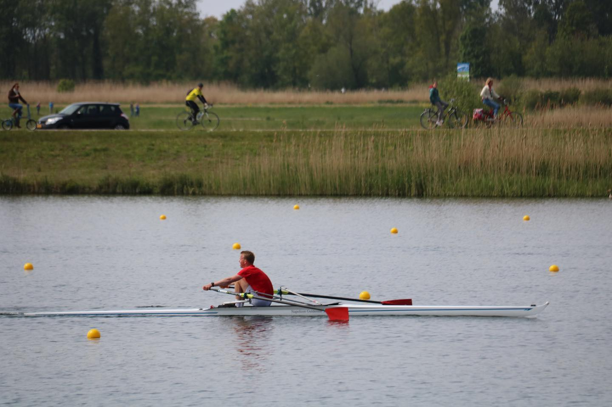
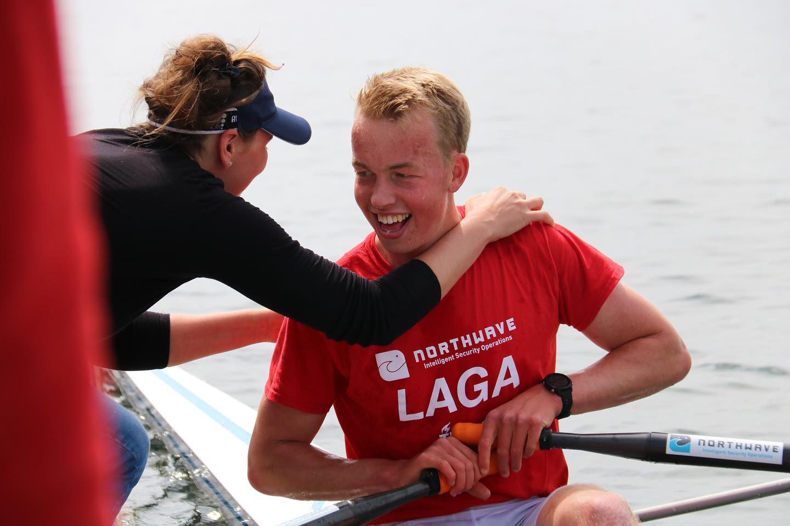

# Rowing

```{image} ../Figures/gedragen_roeiwedstrijd.jpg
---
width: 50%
name: funrowing
align: right
---
Celebrating after winning at the Northwave Regatta in the LM4x (2022)
```

I began rowing at D.S.R.V. Laga in my first year at university, building on the endurance I had developed through competitive running. This foundation helped me earn a spot in the Lightweight Freshman Eight (EJL143). Despite the challenges posed by COVID-19, which led to the cancellation of many races, I remained committed to training and personal development.

My perseverance paid off in my fourth and fifth years, during which I achieved multiple national victories and was selected to compete in several international regattas. Balancing intensive training with academic responsibilities taught me discipline, time management, and resilience. Beyond the sport, I thoroughly enjoyed being part of Laga’s vibrant student association, rich with tradition and camaraderie. Over five years, from my freshman year (143) to my final year (147), rowing became a defining part of my student life and personal growth.

## 2019 (143): Freshman

## 2020 (144) Developing

## 2021 (145): Developing

## 2022 (146): International racing

<div style="display: flex; justify-content: space-around;">
  <figure style="text-align: center; width: 45%;">
    
    <figcaption>Final metres of Raceroei Regatta LHE1x (2022)</figcaption>
  </figure>
    <figure style="text-align: center; width: 45%;">
    
    <figcaption>Celebrating win with my coach Lieke Otten </figcaption>
  </figure>
</div>

```{figure} ../Figures/NKLM4x.jpg
---
name: NKLM4x
align: center
---
Winning the national title in the LM4x at Holland Beker (2022)
```

### World Rowing Cup III
Luzern, Switzerland, LM4x

### European University Championchips
Istanbul, Turkey, LM2x

## 2023 (147): International racing

### World Rowing Cup II
Varese, Italy, LM4x

### Henley Royal Regatta
Henley, England, Prince of Wales, Intermediate M4x

### World University Games
Chengdu, China, LM2x

## Race wins
| Wins | Date        | Laga Year | Race                          | Field   | Time     | Ranked |
|------|-------------|-----------|-------------------------------|---------|----------|--------|
| 1    | 08/12/2018  | 143       | NKIR                          | LHEj8+  | 6:46.0   | ❌     |
| 2    |             | 143       | Winterwedstrijd               | LHB8+   | 16:33.0  | ❌     |
| 3    | 30/06/2019  | 143       | NSRF Slot Wedstrijden         | LHB4+   | 6:57.4   | ✅     |
| 4    | 03/10/2021  | 146       | Heineken Roeivierkamp         | LHG8+   | 182.526  | ❌     |
| 5    | 20/03/2022  | 146       | Head of the River Amstel      | LHG8+   | 25:03.0  | ❌     |
| 6    | 01/05/2022  | 146       | Raceroei Regatta              | LHE1x   | 7:16.7   | ✅     |
| 7    | 29/05/2022  | 146       | Northwave Regatta             | LHE4x   | 6:56.0   | ✅     |
| 8    | 06/06/2022  | 146       | ARB                           | HE2x    | 7:19.6   | ✅     |
| 9    | 07/06/2022  | 146       | ARB                           | LHE4x   | 6:06.2   | ✅     |
| 10   | 07/06/2022  | 146       | ARB                           | LHE8+   | 5:57.7   | ✅     |
| 11   | 26/06/2022  | 146       | Koninklijke Holland Beker     | LH4x    | 6:05.8   | ✅     |
| 12   | 15/10/2022  | 147       | Tromp Boat Race               | LH1x    | 20:28.0  | ❌     |
| 13   | 16/10/2022  | 147       | Tromp Boat Race               | LH4+    | 18:30.9  | ❌     |
| 14   | 06/11/2022  | 147       | Novembervieren                | LHG4*   | 13:01.4  | ❌     |
| 15   | 12/03/2023  | 147       | Head of the River Amstel      | LHG8+   | 23:27.2  | ❌     |
| 16   | 19/03/2023  | 147       | Heineken Roeivierkamp         | LHG8+   | 177.038  | ❌     |
| 17   | 02/04/2023  | 147       | Varsity                       | HG2x    | 7:13.84  | ✅     |
| 18   | 29/04/2023  | 147       | ZRB                           | HG2x    | 6:50.99  | ✅     |
| 19   | 30/04/2023  | 147       | ZRB                           | LHE2x   | 6:42.17  | ✅     |
| 20   | 04/06/2023  | 147       | ARB                           | HE4x    | 6:14.30  | ✅     |
| 21   | 11/06/2023  | 147       | Northwave Regatta             | LHE4x   | 6:00.70  | ✅     |
