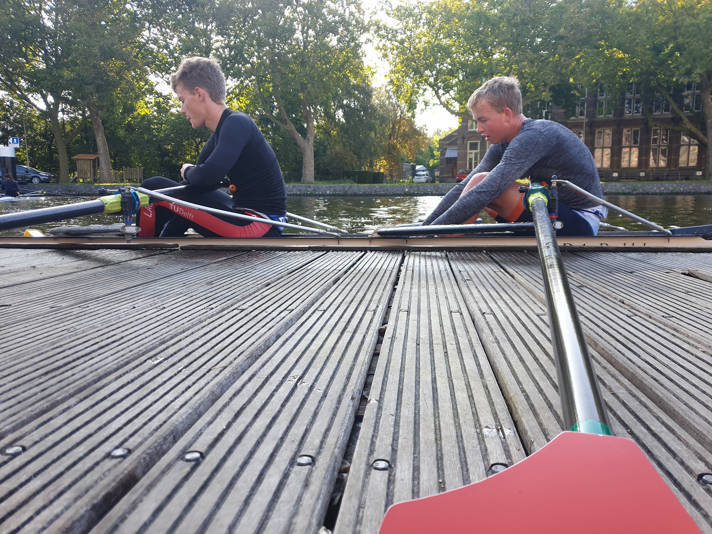
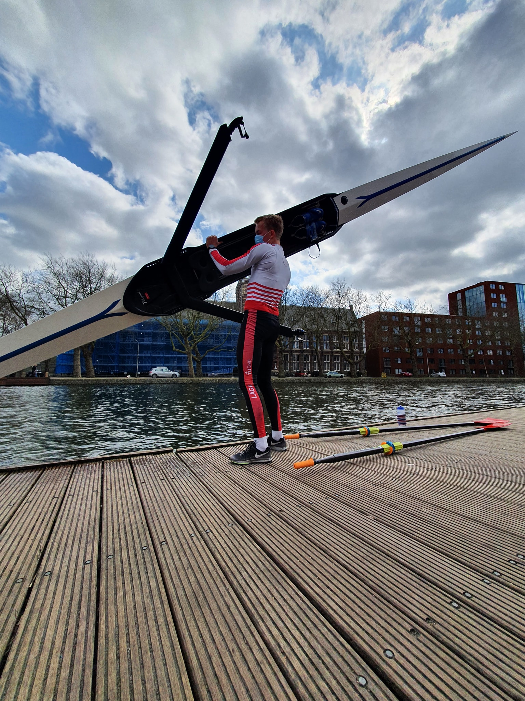
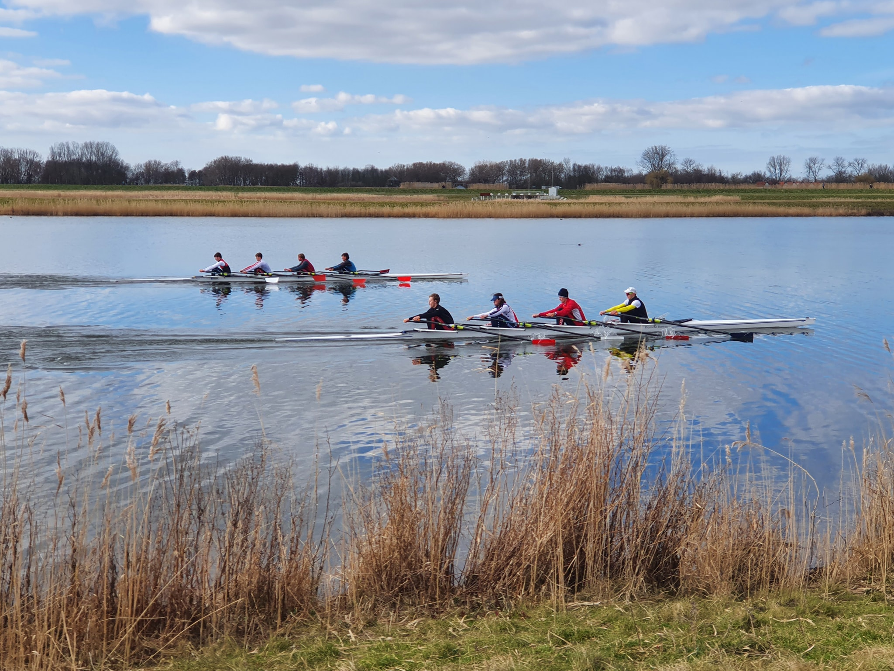
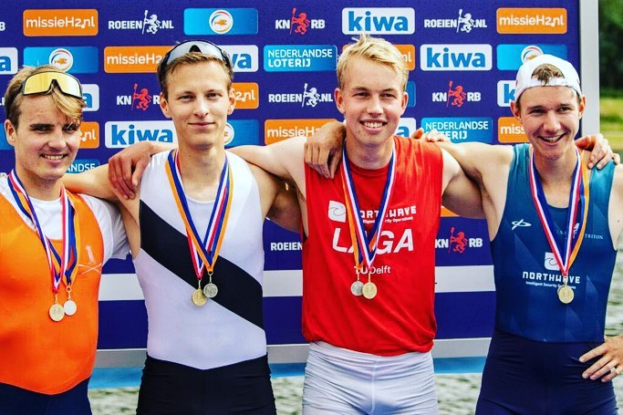
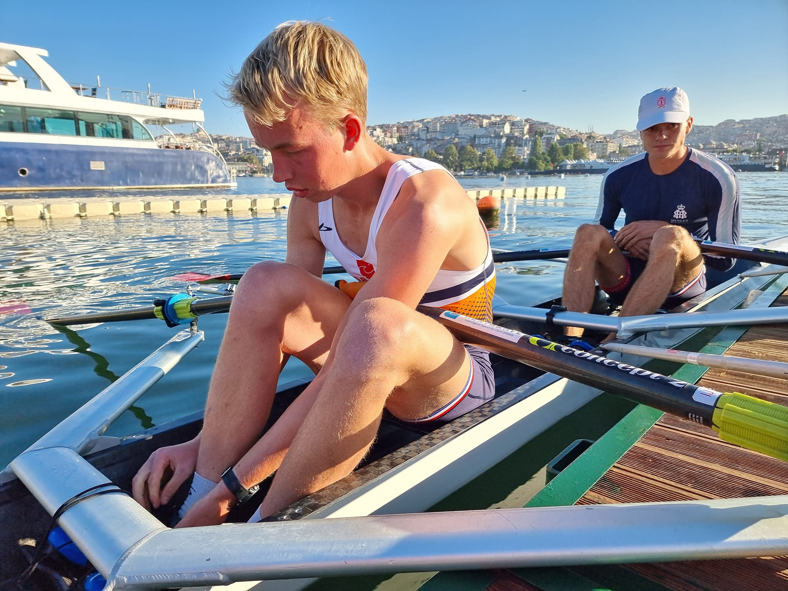
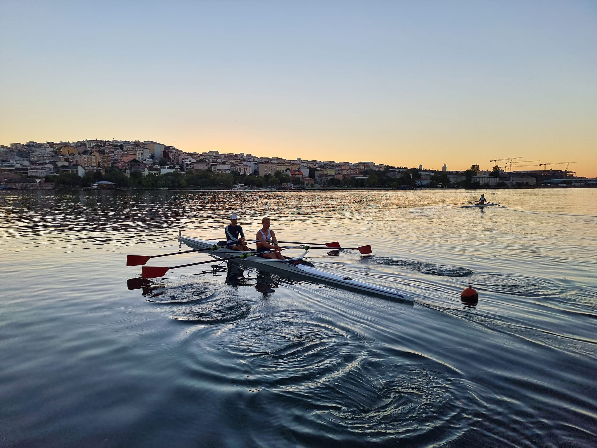
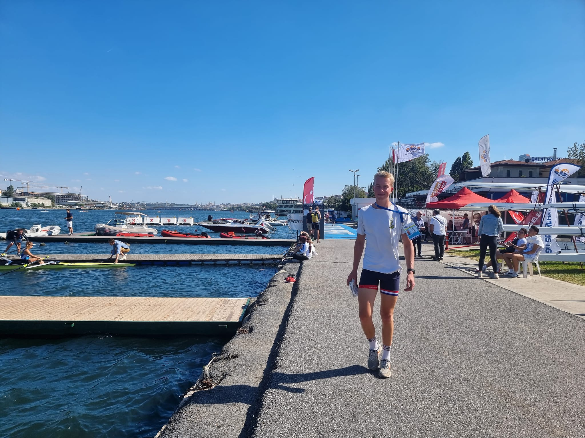

(Rowing)=
# Rowing

```{image} ../Figures/gedragen_roeiwedstrijd.jpg
---
width: 50%
name: funrowing
align: right
---
Celebrating after winning at the Northwave Regatta in the LM4x (2022)
```

I began rowing at D.S.R.V. Laga in my first year at university, building on the endurance I had developed through competitive running. This foundation helped me earn a spot in the Lightweight Freshman Eight (EJL143). Despite the challenges posed by COVID-19, which led to the cancellation of many races, I remained committed to training and personal development.

My perseverance paid off in my fourth and fifth years, during which I achieved multiple national victories and was selected to compete in several international regattas. Balancing intensive training with academic responsibilities taught me discipline, time management, and resilience. Beyond the sport, I thoroughly enjoyed being part of Laga’s vibrant student association, rich with tradition and camaraderie. Over five years, from my freshman year (143) to my final year (147), rowing became a defining part of my student life and personal growth.

## 2019 (143): Freshman
Started rowing at D.S.R.V. Laga. Learned the basics in the Opvang (first 6 weeks introduction period). Did selection or the first year lightweight eight. Made it and got into the crew. Raced the NKIR (Nationals Indoor Rowing) where we won and set a national record. Continued with trianing. Went to Banyoles on training camp. Then started 1st year competition in LHEj8+. Got 4th place in general classification. I learned a lot about rowing and got used to combining a lot of training with a high study load, thereby having to manage my time properly. At the end of year we (Bart, Tiis, me, Willem, coxed by Reinet) managed to get our First classified win at the LHB4+ at the Slotwedstrijden.

## 2020-2021 (144-145): Developing
My second and third year did not contain many races, as a lot were cancelled during covid. However, with a lot of motivation to get better at rowing, I put in a lot of effort on the water and the erg to try to get better. Through my fast erg times, I managed to get a NOC-NSF C-status, thereby getting an elite sport status at TU Delft in my second year. I was planning on racing the LM4- Development Classification, but everything was canceled due to covid just prior to the start of the season. At a time were not able to even go to the club to row, but we had to do alterenative training. During part of that, I went back to my parents (as I could cycle and run there as well and all my university education was moved online) and went out cycling a lot with Michiel and Alex again. After some time, we were allowed to row in singles again, and I picked up sculling and spend a lot of time learning how to do this as I had only done sweeping before.

During my third year I was lucky to get Lieke as coach for the lightweights. She was really experienced in coaching sculling and I learned a lot from here about my technique, as she was always providing feedback and filmed a lot of our training. Apart from technique, she also clearly knew a lot about how the racing schedule worked and gave great shape to our season, outlining and discussing our goals with us, as well as bringing us together as a group of lightweight rowers. A couple of typical weeks of training are displayed below. Additionally, I have added a couple of the many pictures Lieke has taken over the years, of which most are posted on Facebook.

```{Admonition} Training schedule
:class: note, dropdown
| Week / Day        | Monday                                   | Tuesday                             | Wednesday          | Thursday                                                   | Friday                                                  | Saturday                                         | Sunday                                |
|-------------------|------------------------------------------|--------------------------------------|--------------------|-------------------------------------------------------------|---------------------------------------------------------|--------------------------------------------------|---------------------------------------|
| **3-9 January**   | KT                                       | Row 16k 2x                           | Row 16k 2x         | Euromast 2×28k (way back time trial <t20, check avg on stroke coach) | Row 16k 2x                                             | Row 1x 4km warm up + 6×2k (t22–26 alt) r5′ 4km cd | Duinloop/intraining                   |
|                   | Bike Zwift 60′ W206avg HR139avg           | Row 16k 2x                           |                    |                                                             | Row 16k 2x                                             | Row 18k 2x                                      |                                       |
| **10-16 January** | KT                                       | Ergo 2×8k 5′R                        | Ergo 2×8k 5′R      | Ergo 2×10k R5′                                               | Ergo: 3×15′ t24 r5′ (15′ warm up + 5′ cool down)        | Row 2×20k                                        | Row 2× Spar 2×3.5k, 3.5k rest in 21k |
|                   |                                          | Bike Zwift 1h30 W249avg               | KT                 | Bike Zwift 1h20 HR143avg W230avg                            |                                                         | Ergo 3×6 (45″ max, 75″ rest) 8′R                 |                                       |
```

<div style="display: flex; justify-content: space-around; flex-wrap: wrap;">
  <figure style="text-align: center; width: 30%;">
    
    <figcaption>Double with Pim</figcaption>
  </figure>
  <figure style="text-align: center; width: 30%;">
    
    <figcaption>LM1x training</figcaption>
  </figure>
  <figure style="text-align: center; width: 30%;">
    
    <figcaption>LM4x WAB</figcaption>
  </figure>
</div>


## 2022-2023 (146-147): International racing
After 3 years of dedicated training, up to 12 times per week at times, I had worked up myself towards the national top. It was at this moment that I could finally compete and win races and thereby select myself for international races. Winning the LHE1x at the Raceroei Regatta, which is organised by D.S.R.V. Laga was a unique experience. As I got selected for international tournaments, this also meant pairing up for the National Championships in the LM4x, thereby claiming two national titles. In the race were I qualified for the FISU World University Games I also obtained the prestigious SA-status (8 classifying wins).

<div style="display: flex; justify-content: space-around; flex-wrap: wrap;">
  <figure style="text-align: center; width: 30%;">
    
    <figcaption>Final metres of Raceroei Regatta LHE1x (2022)</figcaption>
  </figure>
  <figure style="text-align: center; width: 30%;">
    
    <figcaption>Celebrating win with my coach Lieke Otten</figcaption>
  </figure>
  <figure style="text-align: center; width: 30%;">
    
    <figcaption>Winning the national title in the LM4x at Holland Beker (2022)</figcaption>
  </figure>
</div>

### World Rowing Cup III

```{figure} ../Figures/Rowing_LM4xLuzern.jpg
---
name: LM4xLuzern
width: 300px
align: right
---
Training prior to Luzern World Cup
```

After being selected to represent the Netherlands with Max, Maxim and Stefan (being coached by Lieke) after showing speed at a trial organized by the KNRB, our lightweight men's quadruple sculls crew trained intensively together at the Bosbaan in Amsterdam during the weeks leading up to the World Cup. The race took place on 9 July 2022 at the World Rowing Cup event, where we faced a German crew in a 1 vs 1. We finished just a few seconds behind the German crew, who won with a time of 05:57.44. Our boat crossed the line about 4 seconds later, but our boat was 100 grams under the weight limit, causing us to be disqualified. Although this was not the result we hoped for, it proved to be a valuable experience.

### European University Championchips
Extensive training was done over the summer in Delft leading up to the races. During the season, we qualified and competed in Istanbul, Turkey in the Lightweight Men’s Double Sculls (LM2x) with Jurgen. We reached the A-final and finished in 4th place. Although the result was a bit disappointing since we hoped to make the podium, it was still a great experience. Other crews that went with us, the LM4- and LM4x, did reach the podium, with the LM4x even taking first place. Overall, it was a fantastic experience rowing alongside a close group of friends and our coach Lieke.

<div style="display: flex; justify-content: space-around;">
  <figure style="text-align: center; width: 45%;">
    
  </figure>
    <figure style="text-align: center; width: 45%;">
    
  </figure>
  </figure>
    <figure style="text-align: center; width: 45%;">
    
  </figure>
</div>

### World Rowing Cup II
```{figure} ../Figures/Rowing_VareseLM4x.JPG
---
name: LM4xVarese
width: 300px
align: right
---
Competing at WCII in Varese
```
At the 2023 World Cup in Varese, Italy (17 June 2023), I raced in the Lightweight Men’s Quadruple Sculls Final with Max, Maxim, and Brian, coached by Lieke. We had trained together as a crew in the weeks leading up to the event and lined up against strong international competition. In a tight race, Italy took gold in 5:51.20, Germany silver in 5:53.58, and we claimed the third place for the Netherlands in 5:55.84.

### Henley Royal Regatta
At Henley Royal Regatta in England, we (Brian, me, Maxim and Max, coached by Lieke) competed in the Prince of Wales Challenge Cup for intermediate men's quadruple sculls. In the first round, we won against Njord, but in the second round we faced Leander, a crew that would go on to win the event. Racing at Henley was an incredible experience; the standard of the competition is truly impressive. After losing, tradition dictates you derig your boat and carry it off the site, the infamous “walk of shame” across the parking lot, before loading it onto the trailer. Once the work is done, we relaxed, soaked up the unique Henley atmosphere, and recharged.

<iframe width="560" height="315" src="https://www.youtube.com/embed/Zh3xWsIbM6k?si=qytIhCBs2Og5jqJo" title="YouTube video player" frameborder="0" allow="accelerometer; autoplay; clipboard-write; encrypted-media; gyroscope; picture-in-picture; web-share" referrerpolicy="strict-origin-when-cross-origin" allowfullscreen></iframe>

### FISU World University Games
A really cool experience overall, but unfortunately I had stomach problems. After missing out on the A-finals in the heats and repechage, I decided not to start in the B-final to prioritize my health.

📖Read more about the trip [here](China).

## Race wins
| Wins | Date        | Laga Year | Race                          | Field   | Time     | Ranked |
|------|-------------|-----------|-------------------------------|---------|----------|--------|
| 1    | 08/12/2018  | 143       | NKIR                          | LHEj8+  | 6:46.0   | ❌     |
| 2    |             | 143       | Winterwedstrijd               | LHB8+   | 16:33.0  | ❌     |
| 3    | 30/06/2019  | 143       | NSRF Slot Wedstrijden         | LHB4+   | 6:57.4   | ✅     |
| 4    | 03/10/2021  | 146       | Heineken Roeivierkamp         | LHG8+   | 182.526  | ❌     |
| 5    | 20/03/2022  | 146       | Head of the River Amstel      | LHG8+   | 25:03.0  | ❌     |
| 6    | 01/05/2022  | 146       | Raceroei Regatta              | LHE1x   | 7:16.7   | ✅     |
| 7    | 29/05/2022  | 146       | Northwave Regatta             | LHE4x   | 6:56.0   | ✅     |
| 8    | 06/06/2022  | 146       | ARB                           | HE2x    | 7:19.6   | ✅     |
| 9    | 07/06/2022  | 146       | ARB                           | LHE4x   | 6:06.2   | ✅     |
| 10   | 07/06/2022  | 146       | ARB                           | LHE8+   | 5:57.7   | ✅     |
| 11   | 26/06/2022  | 146       | Koninklijke Holland Beker     | LH4x    | 6:05.8   | ✅     |
| 12   | 15/10/2022  | 147       | Tromp Boat Race               | LH1x    | 20:28.0  | ❌     |
| 13   | 16/10/2022  | 147       | Tromp Boat Race               | LH4+    | 18:30.9  | ❌     |
| 14   | 06/11/2022  | 147       | Novembervieren                | LHG4*   | 13:01.4  | ❌     |
| 15   | 12/03/2023  | 147       | Head of the River Amstel      | LHG8+   | 23:27.2  | ❌     |
| 16   | 19/03/2023  | 147       | Heineken Roeivierkamp         | LHG8+   | 177.038  | ❌     |
| 17   | 02/04/2023  | 147       | Varsity                       | HG2x    | 7:13.84  | ✅     |
| 18   | 29/04/2023  | 147       | ZRB                           | HG2x    | 6:50.99  | ✅     |
| 19   | 30/04/2023  | 147       | ZRB                           | LHE2x   | 6:42.17  | ✅     |
| 20   | 04/06/2023  | 147       | ARB                           | HE4x    | 6:14.30  | ✅     |
| 21   | 11/06/2023  | 147       | Northwave Regatta             | LHE4x   | 6:00.70  | ✅     |
