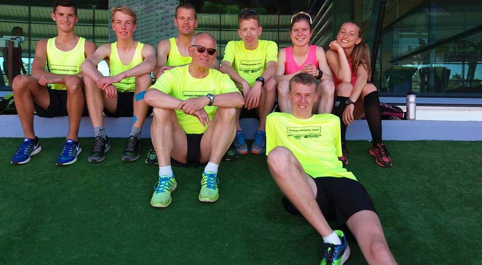
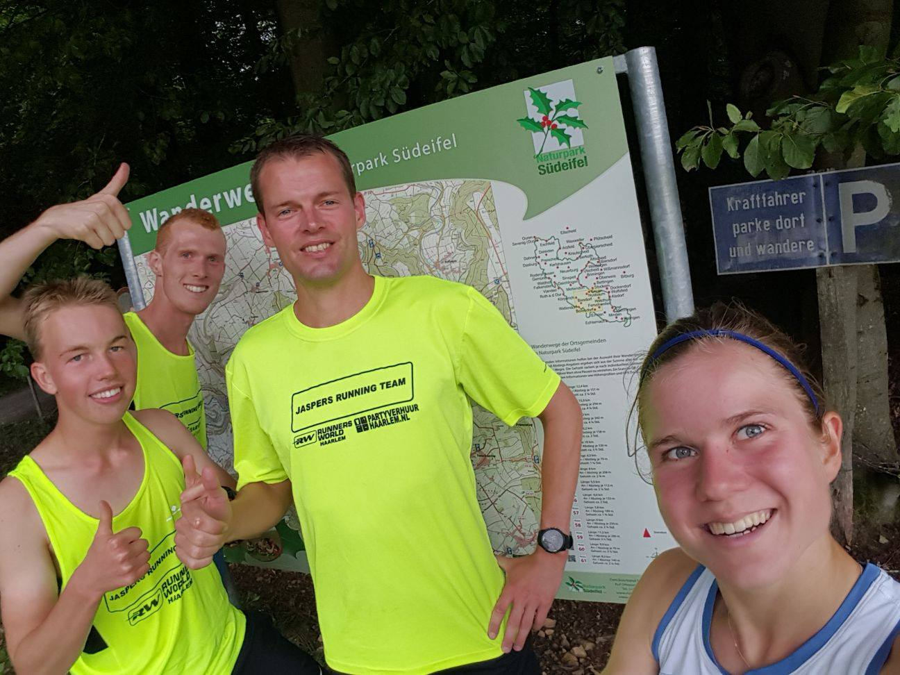
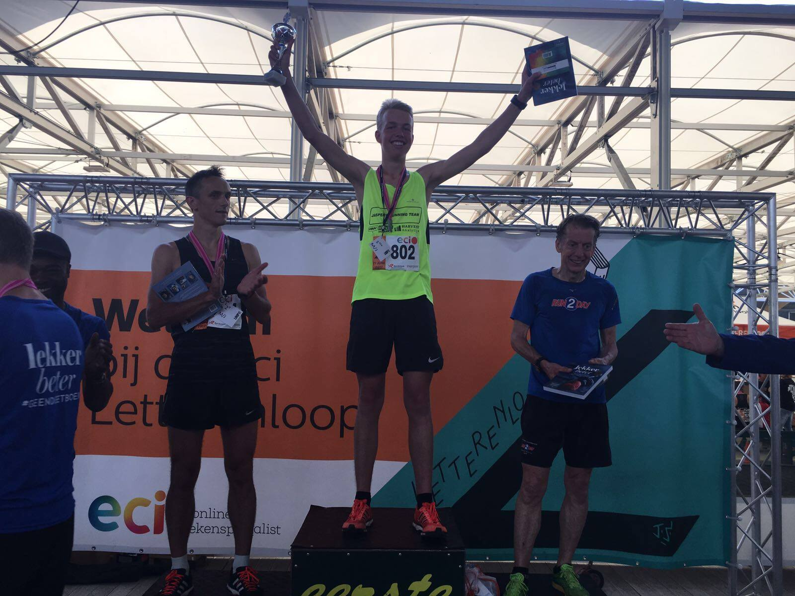
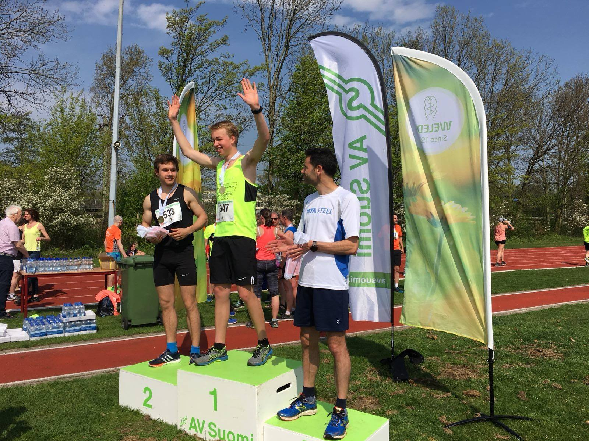

# Running
I developed a strong passion for competitive running during high school, progressing from casual road runs to structured training under professional coaching. As a member of Jaspers Running Team, I competed in national and regional races, achieving personal bests across multiple distances and winning several local events. My commitment included participation in international training camps and a consistent focus on performance improvement.

```{image} ../Figures/ECI_Letterenloop_Banner.jpg
---
:align: center
:width: 95%
---
Winning at the ECI Letterenloop (2017)
```
## Starting
During the last two and a half years of high school I got into running, as I found that my fitness was lacking after a 2 week Christmas holiday. During a run out on the road I met two guys that were doing a training together and they invited me to join their team for some track sessions later. I then started going to track sessions weekly. A couple of weeks later, I was doing 2 track sessions every week. I then decided to quit tennis and ice skating to solemly focus on running. I joined [Jaspers Running Team](https://www.facebook.com/jaspersrunningteam) (JRT).

## Training
Within half a year, I was running with a schedule, 6 days a week, coached by Koos Kiers. To get an idea of what it looked like, a typical week is included below. Competitive and ambitious as I am, I wanted to run well. Additionally, during my years at JRT, we went to two training camps.
| Monday | Tuesday | Wednesday | Thursday | Friday | Saturday | Sunday |
|--------|---------|-----------|----------|--------|----------|--------|
| Rest   | Track. Technique. 1200-1000-800-600-400 P 7-5-3-1 at 5 = 3K | Endurance run 1-2 8-12 km (recovery) | Endurance run 1-2 10-12 km + 8 x 100 sprints | Track: technique 3200 (400+200"/200+55") after rest. 1000+800+600+400 -200 at 3K /1500 P. 2 x LT | Endurance run 2, 12 km | Endurance run max 15 km 5x5' at threshold/10K pace 5' rest |

<div style="display: flex; justify-content: space-around;">
  <figure style="text-align: center; width: 45%;">
    
    <figcaption>Training camp in Monte Gordo, Portugal (2017)</figcaption>
  </figure>
    <figure style="text-align: center; width: 45%;">
    
    <figcaption>Training camp in Diekirch, Luxembourg (2017) </figcaption>
  </figure>
</div>

## Racing
I trained to be competitive at races. I initially started with local road races of 5 km. I also ran at track meets and bigger road races in The Netherlands to improve my personal bests, such as the Singelloop and NN Zevenheuvelenloop. I also competed at the junior nationals in the 10k road race and cross. I won some local races as demonstrated in the pictures below.

<div style="display: flex; justify-content: space-around;">
  <figure style="text-align: center; width: 45%;">
    
    <figcaption>Winning at the ECI Letterenloop 5 km in Bloemendaal, The Netherlands (2017) </figcaption>
  </figure>
  <figure style="text-align: center; width: 45%;">
    
    <figcaption>Winning at the Pim Mulier Grachtenloop 5 km in Santpoort, The Netherlands (2018)</figcaption>
  </figure>
</div>

## Personal records
| Distance    | Time   | Date | Location      |
|--------------|----------|--------|---------------|
| 1500 m   | 4:35,64  | 15/04/2018     | Track, Haarlem, The Netherlands |
| 3000 m  | 9:48,96  | 13/07/2018     | Track, Utrecht, The Netherlands |
| 5000 m   | 17:23,55 | 07/07/2017     | Track, Wageningen, The Netherlands |
| 10 km | 36:43 | 01/10/2017 | Singelloop, Utrecht, The Netherlands |
| 15 km | 56:34 | 19/11/2017 | NN Zevenheuvelenloop, Nijmegen, The Netherlands |
| 10 EM | 1:01:59 | 17/09/2017 | Dam tot Damloop, Amsterdam, The Netherlands |
| HM | 1:21:45 | 03/10/2024 | NN CPC Loop, The Hague, The Netherlands |


