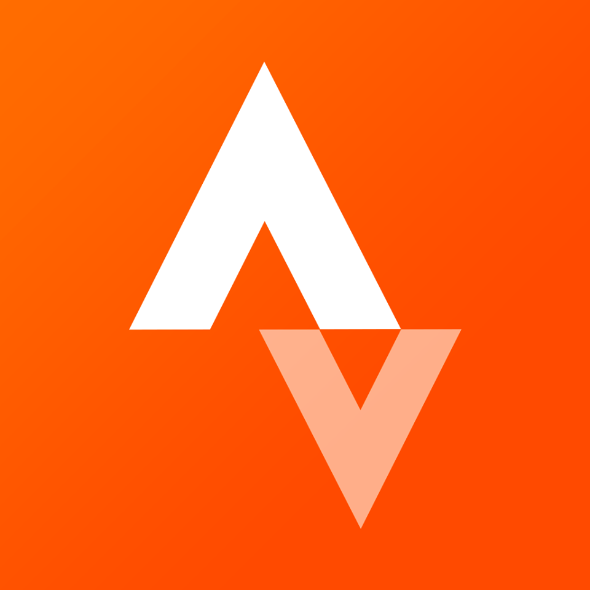

# Sports

Sports have always been a big part of my life. From playing field hockey as a child to competing internationally in rowing, each sport has shaped me in different ways. I’ve always enjoyed pushing my limits, whether in competition or just for the fun of it. Below is an overview of my sports journey, with dedicated pages on [rowing](#rowing), [running](#running), and [cycling](#cycling).

---

## 🏑 Field Hockey

```{figure} Figures/HCBloemendaal.jpg
---
figclass: margin
name: HCBloemendaal_logo
height: 100px
---
```

When I was young, I started playing at the 'Musjes' at HC Bloemendaal, the youngest age group at the club. I quickly became quite fanatic. As a second-year D-player, I was selected for the first team and we competed at a high level. After performing well regionally, we qualified for "D-day," a national one-day championship for regional top teams. I vividly remember scoring a shoot-out in the semi-final, after which we advanced to the final, where we lost to Rotterdam. This was the highlight of my field hockey career.

The following year in the C's, I wasn’t selected for the first team because I had been on a 5-week summer holiday to {ref}`Australia`, and wasn’t back in time for team selection. I played in the second team in both the C’s and B’s, competing in the Topklasse A. After the B’s, I decided to stop playing field hockey to focus on other sports.

---

## ⛸️ Ice Skating & Tennis

```{figure} Figures/natuurijs_Loosdrecht.jpg
---
align: right
width: 350px
name: naturalice
---
Ice skating on natural ice at the  
Loosdrechtse Plassen with Anthony,  
Martin and Joris
```

I played tennis once or twice a week for several years, but eventually stopped to concentrate on running. Another sport I really enjoyed was ice skating — a classic Dutch pastime. I started with lessons at Kras Sport and went skating outside whenever weather allowed it. Later, I joined IJsclub Haarlem and competed in multiple races.

I enjoyed it so much that I eventually started teaching children how to skate at {ref}`KrasSport`.

---

## 🏃 Running → {ref}`Running`

The last three years of high school (2016–2018), I focused on running. I mainly trained for the 5K (PR 17:23) and 10K (PR 36:43). I ran frequently and enjoyed the structured training routines.  
📄 **Read more:** {ref}`Running`

---

## 🚣 Rowing → {ref}`Rowing`

```{figure} Figures/NKLM4x.jpg
---
align: right
width: 350px
name: NKLM4x
---
Winning the national title in the  
LM4x at Holland Beker (2022)
```

When I started studying in Delft, I joined D.S.R.V. Laga and took up rowing competitively. After beginning as a freshman rower, I later became national champion twice (LM4x) and raced at international events such as the World Cups, Henley Royal Regatta, and the FISU World University Games.

📄 **Read more:** {ref}`Rowing`

---

## 🚴 Cycling → {ref}`Cycling`

After quitting rowing to focus on my studies, I took up cycling — which allowed me more flexibility. I had cycled as a kid but never this seriously. I joined WTOS Delft and participated in many races, Gran Fondos, and cycling holidays.

One highlight was racing the Team Time Trial at the National Championships for Clubs, where our club selected the top six riders.  
📄 **Read more:** {ref}`Cycling`

---

### 📊 Follow me on Strava

<div style="display:flex; align-items:center; margin-bottom:8px;">
  
  <a href="https://strava.app.link/8Gn9v1kVwVb">Strava</a>
</div>