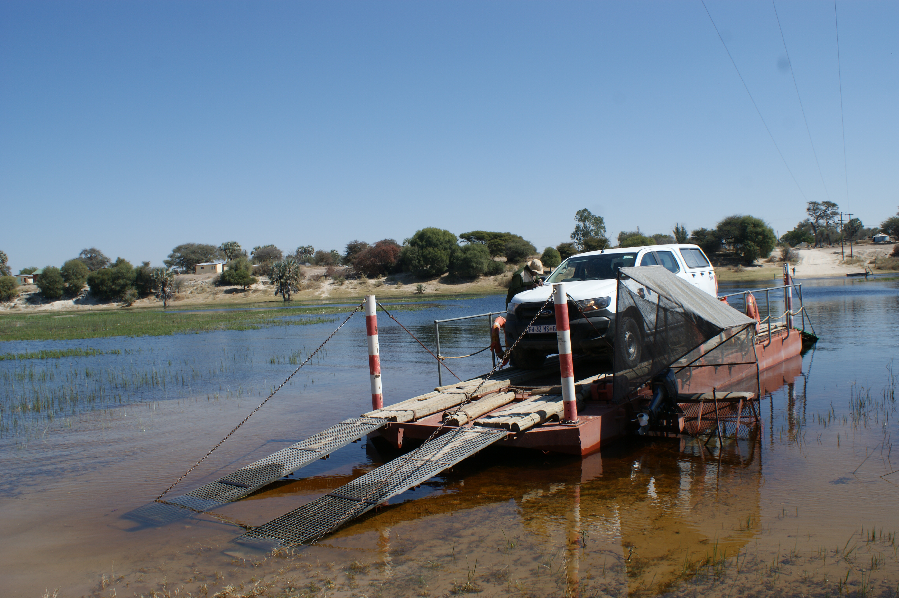
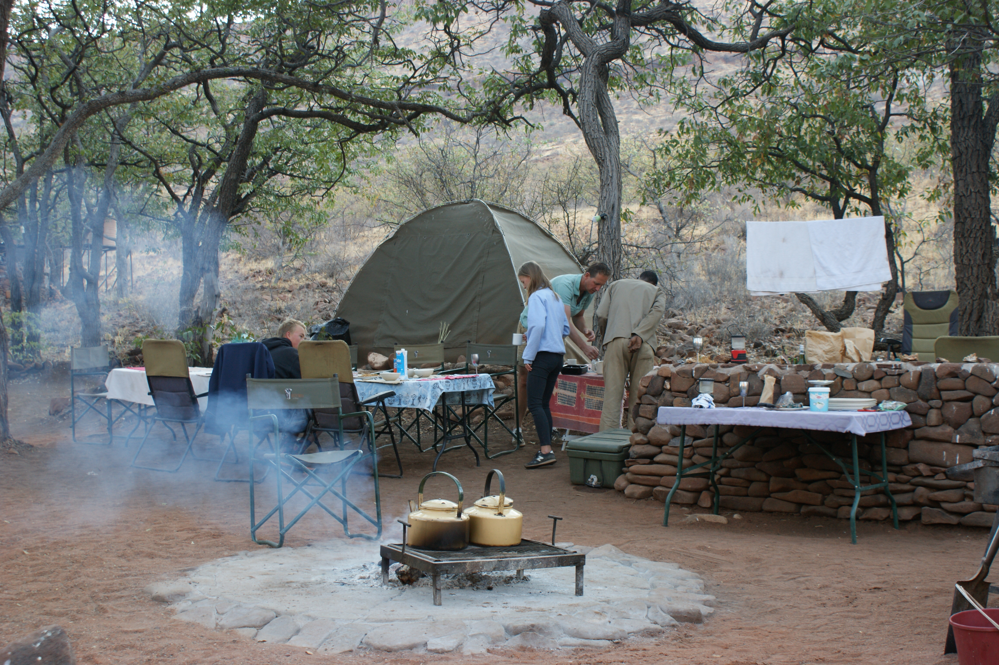
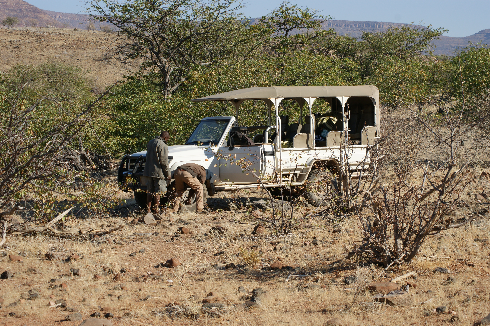
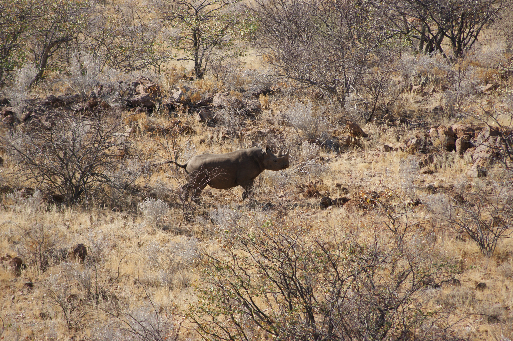
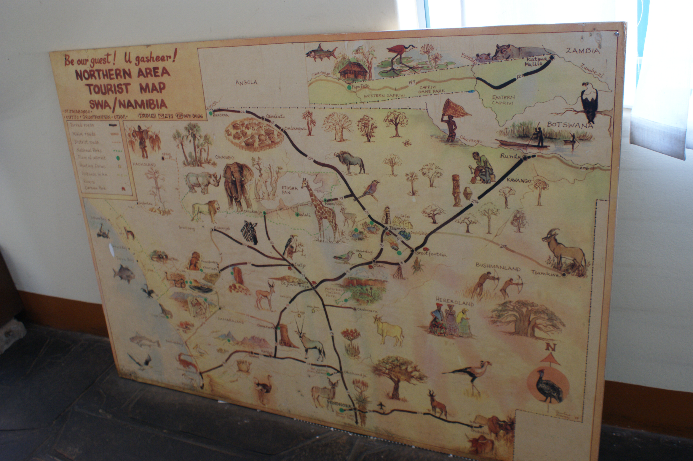
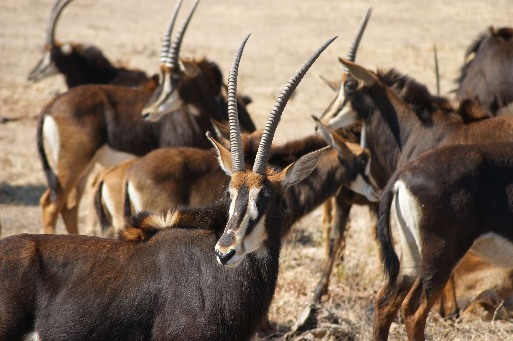
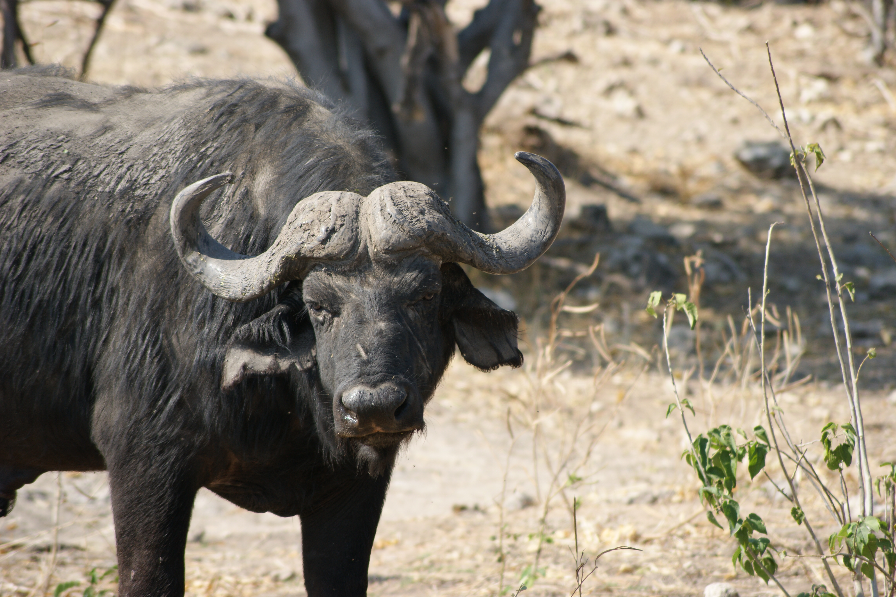
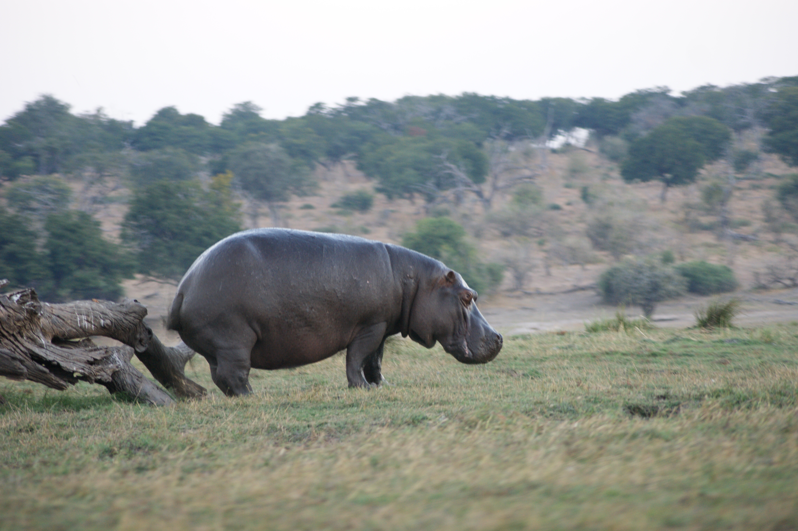
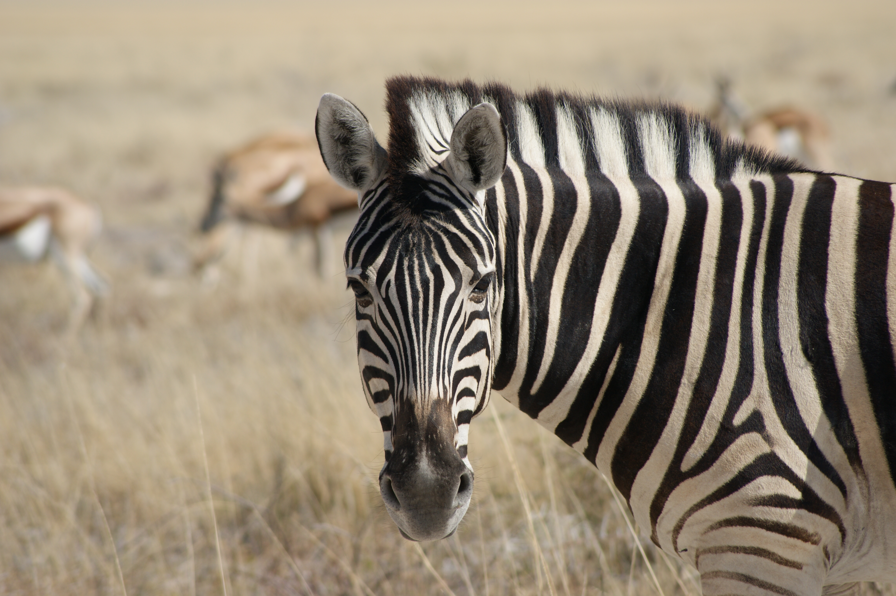
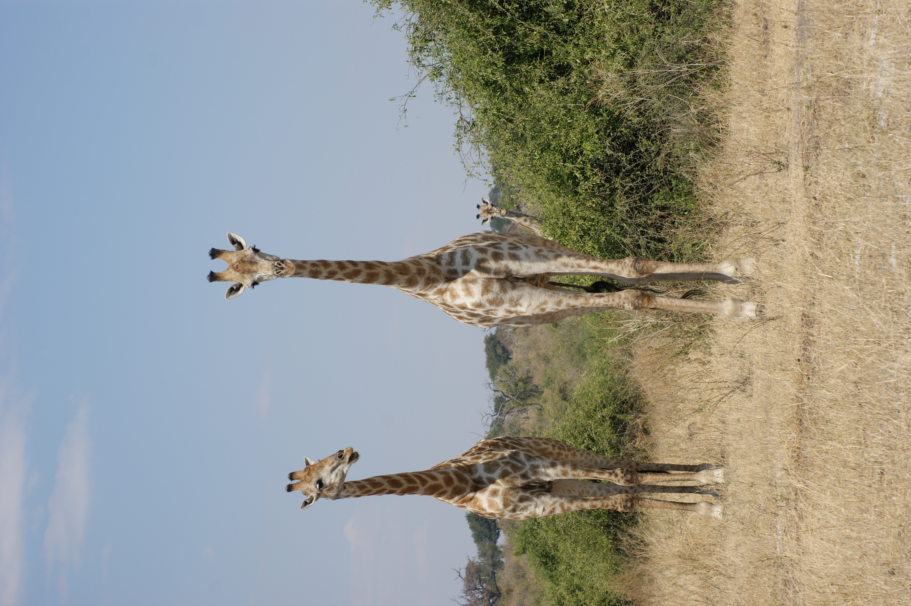

(Namibia)=
# Namibia
A memorable family adventure in 2017 exploring Namibia by road trip. Highlights include camping with a 4x4 truck, experiencing thrilling safaris, visiting stunning national parks, sandboarding and finishing with a day trip to the majestic Victoria Falls in neighboring Zimbabwe. We also went sandboarding.

- 👨‍👩‍👧‍👧 Trip type: Family (Anthony, Ilse, Kim, Niels, Anke)
- 🗓️ Duration: 2017
- 📍 Highlights: Road tripping, Safari, National Parks, Victoria Falls

```{figure} Figures/Namibia_SandboardingDesert.JPG
---
name: sandboarding
align: center
width: 70%
---
Sandboarding in the desert
```

## Road tripping
An exciting journey across Namibia in our trusty 4x4 truck, camping under the stars in tents, and enjoying the freedom of the open road surrounded by breathtaking landscapes.

<div style="display: flex; justify-content: space-around;">
  <figure style="text-align: center; width: 45%;">
    
    <figcaption>Ferry with our 4x4 truck</figcaption>
  </figure>
  <figure style="text-align: center; width: 45%;">
    
    <figcaption>Tent</figcaption>
  </figure>
</div>

## Safari: Black Rhino
We had a thrilling safari experience, where we initially had car trouble after we headed out early in the morning. We were deep in the wilderness at that time and my twin sister got really scared. This demonstrated how remote parts of Africa are, although after waiting for two hours, people came to fix it, after which we continued on the trip. In the end we encountered the rare Black Rhino, which we were aiming to find, so it ended up being a good story.

<div style="display: flex; justify-content: space-around;">
  <figure style="text-align: center; width: 45%;">
    
    <figcaption>Car trouble on safari</figcaption>
  </figure>
  <figure style="text-align: center; width: 45%;">
    
    <figcaption>Black Rhino</figcaption>
  </figure>
</div>

## National Parks
Exploration of Namibia’s rich natural parks, spotting diverse wildlife such as antelopes, buffalo, hippos, zebras, and giraffes, set against the backdrop of vast and scenic landscapes.

<table style="width: 100%; table-layout: fixed;">
  <tr>
    <td style="width: 33.33%;"></td>
    <td style="width: 33.33%;"></td>
    <td style="width: 33.33%;"></td>
  </tr>
  <tr>
    <td style="width: 33.33%;"></td>
    <td style="width: 33.33%;"></td>
    <td style="width: 33.33%;"></td>
  </tr>
</table>


## Zimbabwe: Victoria Falls
A family day trip to the awe-inspiring Victoria Falls, marveling at one of the world’s largest and most spectacular waterfalls, creating lasting memories together.

```{figure} Figures/Namibia_VictoriaFalls.JPG
---
name: victoriafalls
align: center
---
Our family at the Victoria Falls
```
