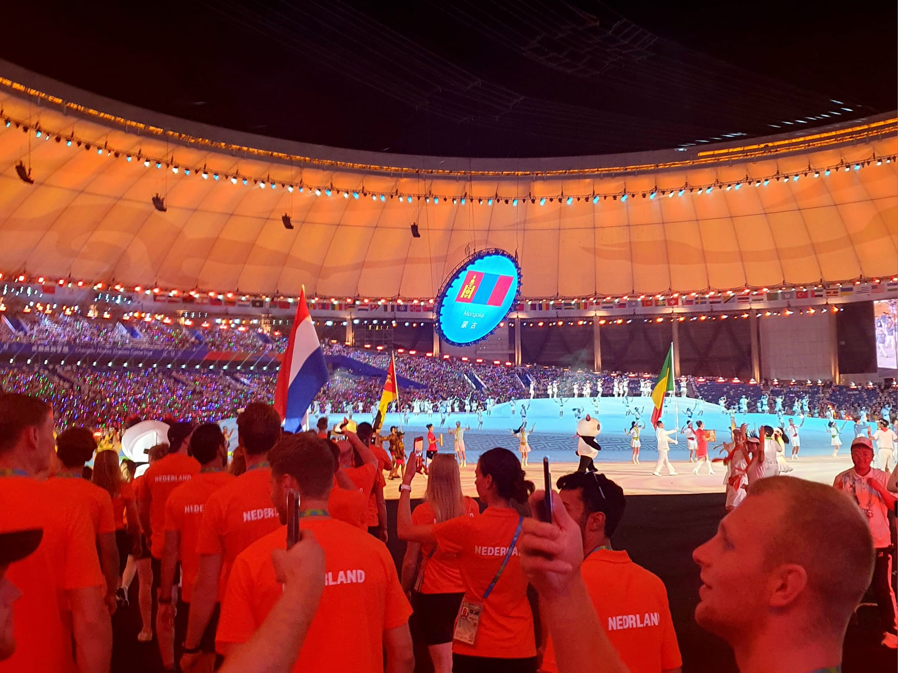
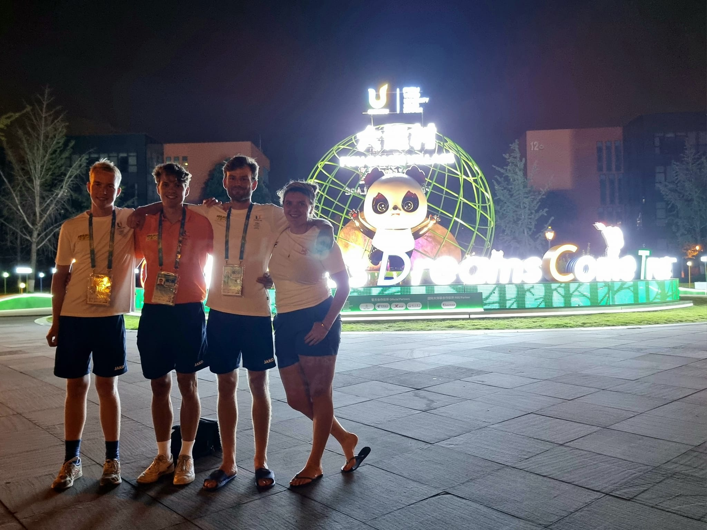
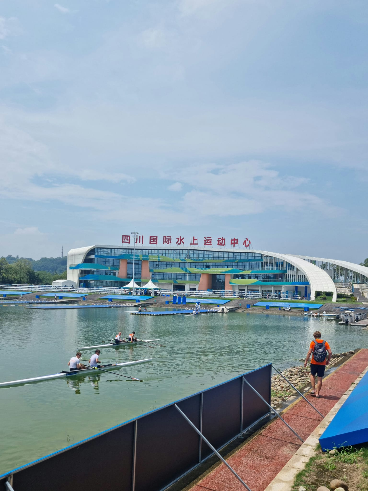
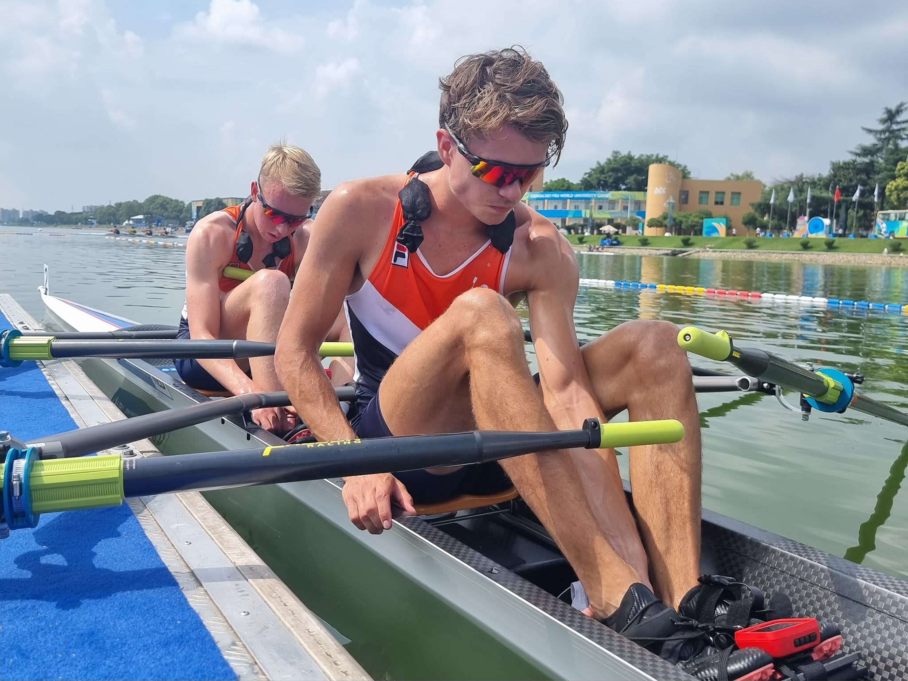
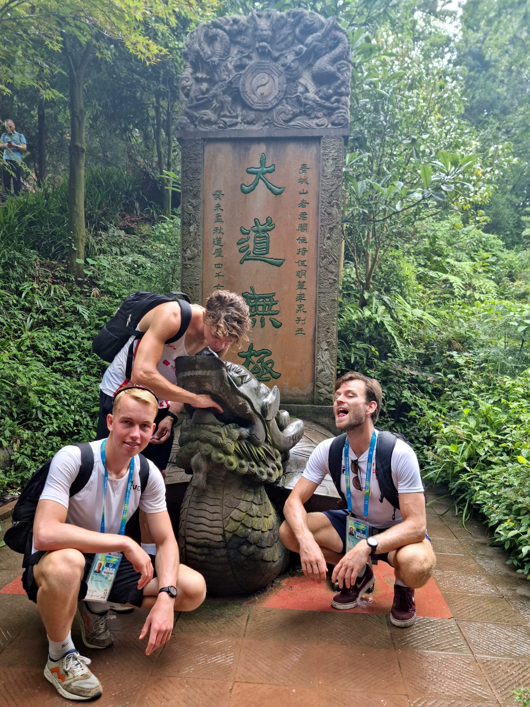
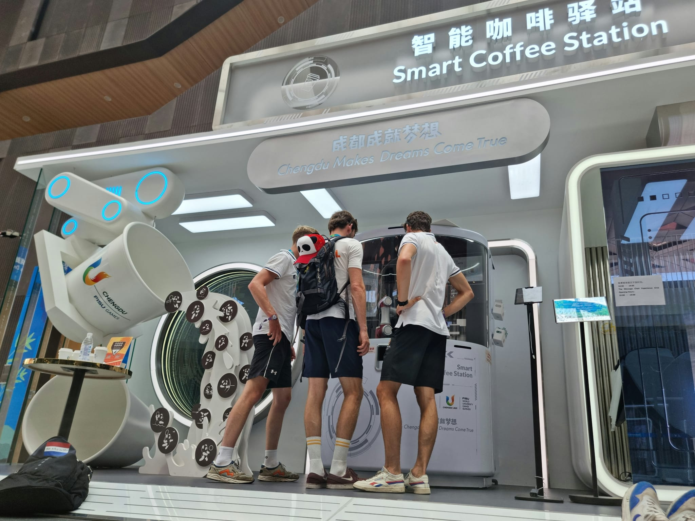
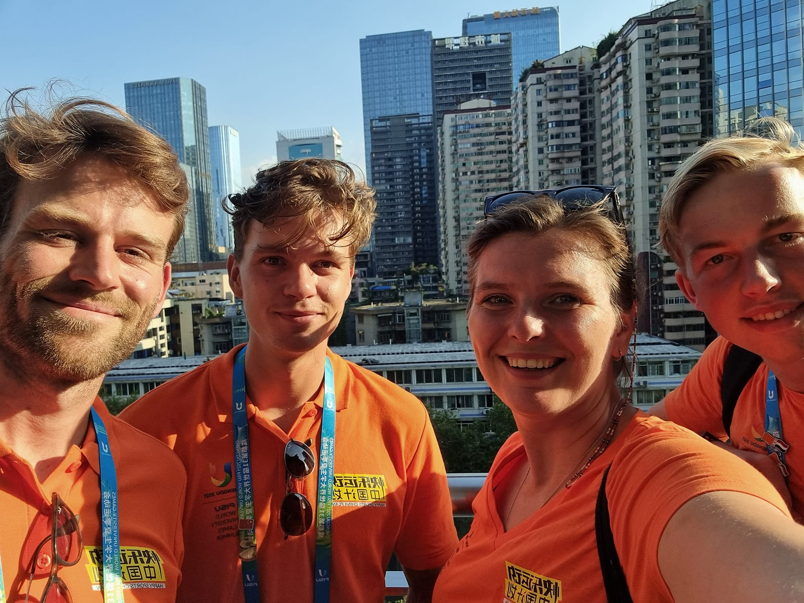
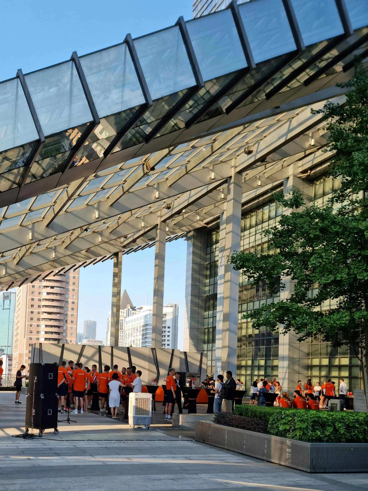

(China)=
# China

China was the setting for a focused and challenging sports trip where performance was the main priority. Chengdu, the vibrant capital of Sichuan province, served as our base for training and competing at the World University Games. Unfortunately, due to stomach issues, my performance didn’t go as planned. After dedicating ourselves to racing and preparation, and recovering from stomach problems, we still had the chance to enjoy the rich local culture and famous sights, making the trip both rewarding and memorable.

- 👨‍👩‍👧‍👧 Trip type: Sports (Lieke (Coach), Jurgen (LM2x), Niels (LM2x), Brian (LM1x))
- 🗓️ Duration: 2 weeks (27/07/2023 - 09/08/2023)
- 📍 Highlights: Opening ceremony, Rowing Venue, Village

## FISU World University Games Chengdu

Our arrival in Chengdu was marked by a special experience: we were transported on buses adorned with the games’ stickers, using dedicated lanes to reach the University campus, which served as our “mini Olympic village.” On July 28, 2023, the opening ceremony took place in the Sichuan Province capital, a grand event attended by President Xi Jinping, who officially opened the games. The ceremony was both inspiring and festive, with the Dutch delegation proudly marching in among dozens of countries at 48:40 in the video below.

  <figure style="text-align: center; width: 45%;">
    
    <figcaption>Opening ceremony</figcaption>
  </figure>
  <figure style="text-align: center; width: 45%;">
    
    <figcaption>Village</figcaption>
  </figure>

  <iframe 
    width="60%" 
    src="https://www.youtube.com/embed/wMjYe6TtXek?si=8tHSm_kNs3VWNbnS" 
    title="YouTube video player" 
    frameborder="0" 
    allow="accelerometer; autoplay; clipboard-write; encrypted-media; gyroscope; picture-in-picture; web-share" 
    referrerpolicy="strict-origin-when-cross-origin" 
    allowfullscreen>
  </iframe>

## Rowing
The rowing events were held at the Sichuan Water Sports School in the Xinjin District of Chengdu. This venue doubled as a competition site and a training center for athletes. We rowed in brand new Peishen boats—similar in design to Fillipi boats but equipped with slightly more flexible oars. The ergometers resembled Concept 2 machines but were locally produced models. I competed with Jurgen in the Lightweight Men's Double Sculls. Unfortunately, I faced stomach issues two days before the heats and had to cut weight to meet the 70.0 kg limit, about 1.5 kg lighter than usual, which affected my performance. Despite the setbacks, we competed in the heats and repechage but didn’t make the A-final. For health reasons, we decided to skip the B-final. It was very sad that we could not compete at our very best at the tournament we came to Chengdu for in the first place.

  <figure style="text-align: center; width: 45%; display: flex; flex-direction: column;">
    
    <figcaption>Venue of the rowing</figcaption>
  </figure>
  <figure style="text-align: center; width: 45%; display: flex; flex-direction: column;">
    
    <figcaption>Heading out for racing</figcaption>
  </figure>

## Exploring Chengdu
After the races were over, we still had about a week left and with more food, enough fluids, rest and no need to practica outside in 35 degrees Celsius I quickly got better and could enjoy Chengdu still a bit. We got a limited number of tickets per participant to explore other things Chengdu has to offer, so we went on two trips.

We went hiking at Mt. Qingcheng, a beautiful and peaceful mountain known as one of the birthplaces of Taoism. The trails were surrounded by lush greenery, and we got to see several ancient temples hidden in the forest. It was a great way to experience both nature and Chinese culture.

We also visited the Chengdu Panda Base, where we saw giant pandas up close, including some playful cubs and large adults. It was amazing to watch them in their natural habitat, and since the panda was the mascot of the Games, the visit felt extra special. I even bought some panda souvenirs to take home.

  <figure style="text-align: center; width: 40%; display: flex; flex-direction: column;">
    
    <figcaption>Hiking at Mt. Qingcheng</figcaption>
  </figure>
  <figure style="text-align: center; width: 50%; display: flex; flex-direction: column;">
    
    <figcaption>Coffee robot in village</figcaption>
  </figure>

## Rooftop drinks with sponsor
At the beginning of our stay, we were invited by Happy Sports, one of the sponsors of the Dutch delegation, to enjoy drinks on a rooftop bar overlooking the city. This was a cool way to explore the city skyline.

  <figure style="text-align: center; width: 60%; display: flex; flex-direction: column;">
    
    <figcaption>Lieke, Jurgen, Brian and me at the rooftop</figcaption>
  </figure>
  <figure style="text-align: center; width: 30%; display: flex; flex-direction: column;">
    
    <figcaption>Rooftop Happy Sports</figcaption>
  </figure>

