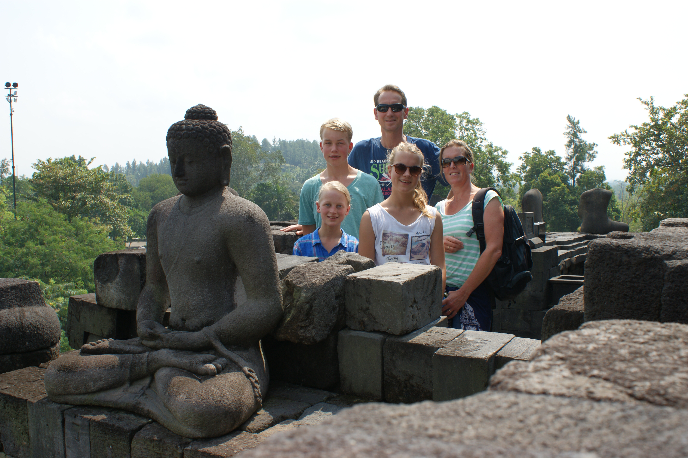
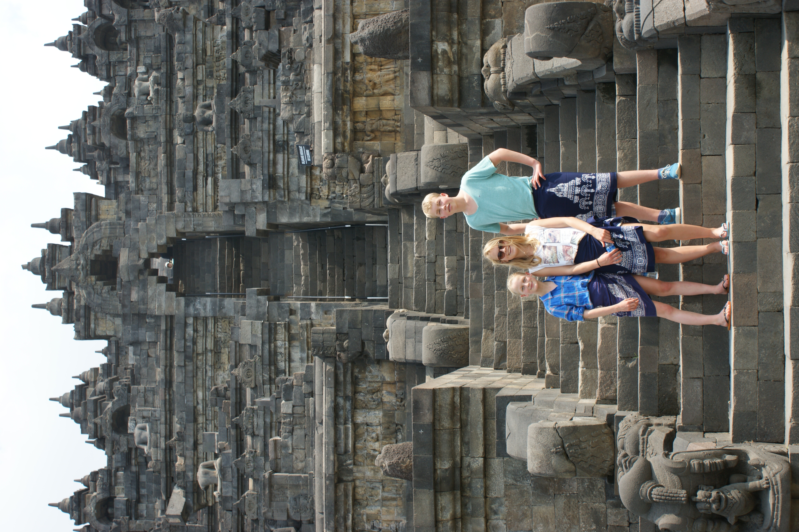
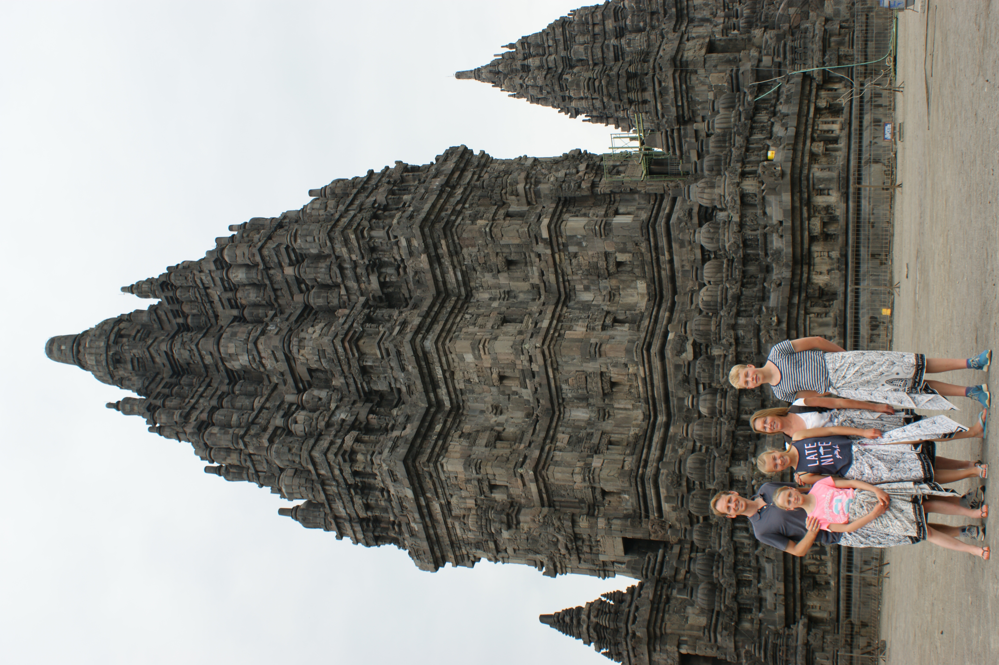
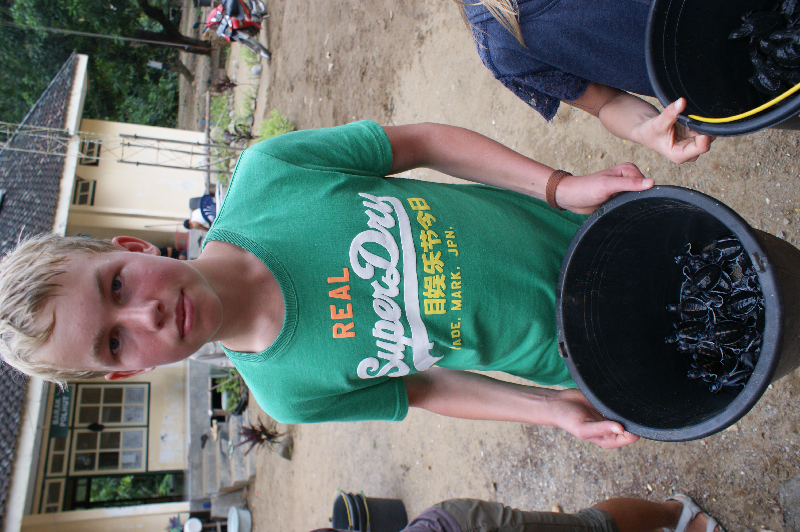
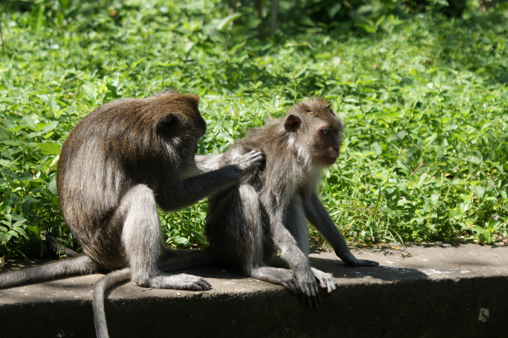
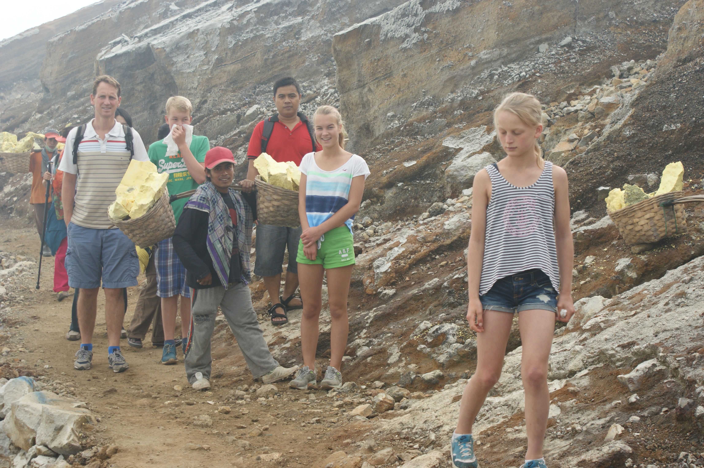
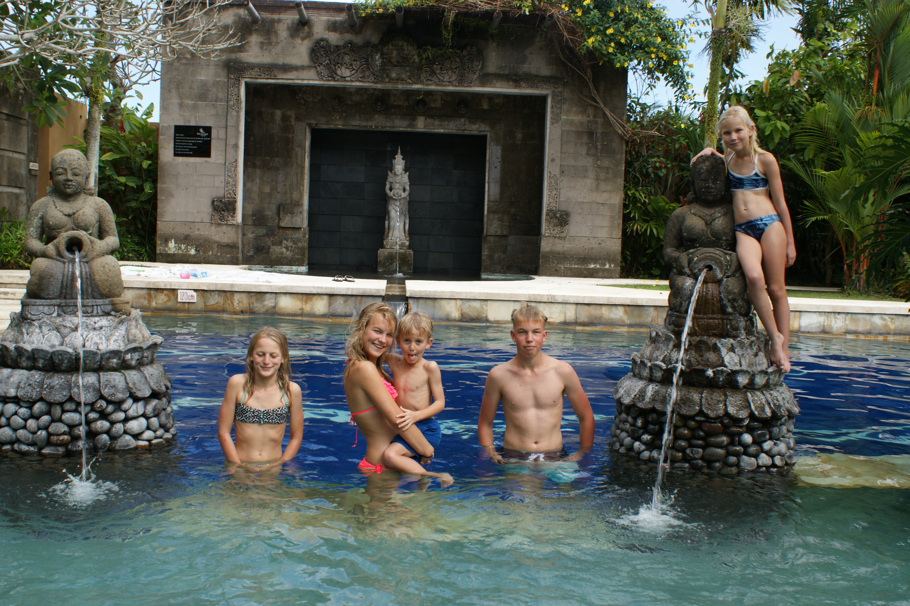

(Indonesia)=
# Indonesia
Fly to jakarta, then yogjakarta, get driven over to east of 

- 👨‍👩‍👧‍👧 Trip type: Family (Anthony, Ilse, Kim, Niels, Anke)
- 🗓️ Duration: 2014
- 📍 Highlights:

## Visiting temple
Visiting temple

  <figure style="text-align: center; width: 50%;">
    
    <figcaption>Family</figcaption>
  </figure>
  <figure style="text-align: center; width: 25%;">
    
    <figcaption>Temple</figcaption>
  </figure>
  <figure style="text-align: center; width: 25%;">
    
    <figcaption>Temple</figcaption>
  </figure>

## Turtle
Setting out turtles into the sea

  <figure style="text-align: center; width: 30%;">
    
    <figcaption>Me with a bucket of mini turtles</figcaption>
  </figure>
  <figure style="text-align: center; width: 30%;">
    
    <figcaption>Watching the turtles go to the sea</figcaption>
  </figure>

## Further exploration
Watching monkeys
Climbing sulfur mountain
Relaxing at resort

  <figure style="text-align: center; width: 33%;">
    
    <figcaption>Monkeys</figcaption>
  </figure>
  <figure style="text-align: center; width: 33%;">
    
    <figcaption>Sulfur mountain</figcaption>
  </figure>
  <figure style="text-align: center; width: 33%;">
    
    <figcaption>Resort</figcaption>
  </figure>

