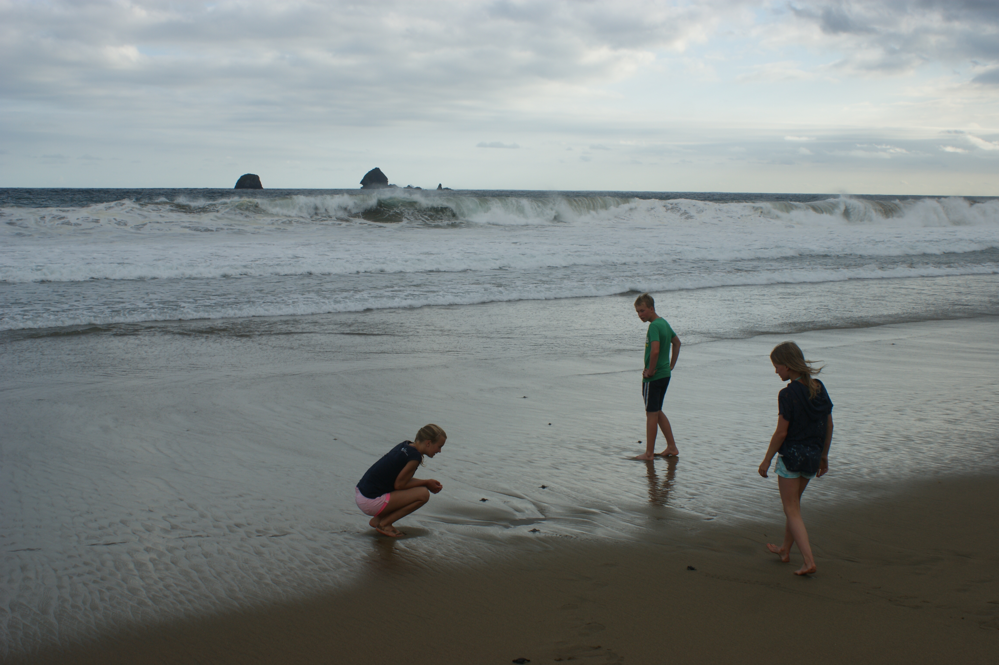

(Indonesia)=
# Indonesia
Indonesia, the world’s largest archipelago, is known for its rich cultural heritage, diverse landscapes, and vibrant traditions. In 2014, we explored the island of Java, starting in the bustling capital Jakarta before flying to Yogyakarta. From there, we traveled eastward by car, passing endless rice fields and small villages, experiencing the heart of rural life. Along the way, we visited world-famous temples, trekked up volcanic slopes, watched wildlife in their natural habitat, and took part in a turtle conservation project.

- 👨‍👩‍👧‍👧 Trip type: Family (Anthony, Ilse, Kim, Niels, Anke)
- 🗓️ Duration: 2014
- 📍 Highlights: Borobudur and Prambanan temples, sea turtle conservation, Mount Ijen

## Visiting temples
We visited Borobudur, built in the 8th–9th century during the Sailendra dynasty, the world’s largest Buddhist monument and a key pilgrimage site in Southeast Asia. Its nine stacked platforms are decorated with over 2,600 relief panels and 504 Buddha statues. The second site, Prambanan, dates to the 9th century and was built under the Sanjaya dynasty as a Hindu temple complex dedicated to the Trimurti: Brahma, Vishnu, and Shiva. Prambanan is the largest Hindu temple site in Indonesia and is known for its tall, pointed architecture and intricate stone carvings depicting scenes from the Ramayana. Both sites require visitors to wear modest clothing in accordance with local customs.

  <figure style="text-align: center; width: 50%;">
    
    <figcaption></figcaption>
  </figure>
  <figure style="text-align: center; width: 25%;">
    
    <figcaption></figcaption>
  </figure>
  <figure style="text-align: center; width: 25%;">
    
    <figcaption></figcaption>
  </figure>

## Sea turtle conservation
On the southern coast of Java, we visited a turtle conservation site dedicated to protecting endangered sea turtle species, primarily the green sea turtle (Chelonia mydas). Eggs collected from vulnerable nesting beaches are incubated until hatching. Hatchlings are then released to the ocean, a conservation method aimed at increasing survival rates. This practice is part of broader efforts across Indonesia to counter the decline in sea turtle populations caused by habitat loss, illegal hunting, and pollution.

  <figure style="text-align: center; width: 30%;">
    
    <figcaption>Me with a bucket of mini turtles</figcaption>
  </figure>
  <figure style="text-align: center; width: 30%;">
    
    <figcaption>Watching the turtles go to the sea</figcaption>
  </figure>

## Further exploration
In eastern Java, we visited a forested park where monkeys live in semi-wild conditions, often inhabiting areas near temples and tourist paths. We also climbed Mount Ijen, an active volcano rising 2,799 meters above sea level, famous for its sulfur mining operations and acidic turquoise crater lake, one of the largest in the world. The crater emits sulfur gases that ignite upon contact with air, producing rare _blue flames_ visible at night. Our journey concluded at a coastal resort, a common tourism development in Java’s eastern region, which supports the local economy through hospitality and marine-based recreation.

  <figure style="text-align: center; width: 33%;">
    
    <figcaption>Monkeys</figcaption>
  </figure>
  <figure style="text-align: center; width: 33%;">
    
    <figcaption>Mount Ijen</figcaption>
  </figure>
  <figure style="text-align: center; width: 33%;">
    
    <figcaption>Resort</figcaption>
  </figure>

