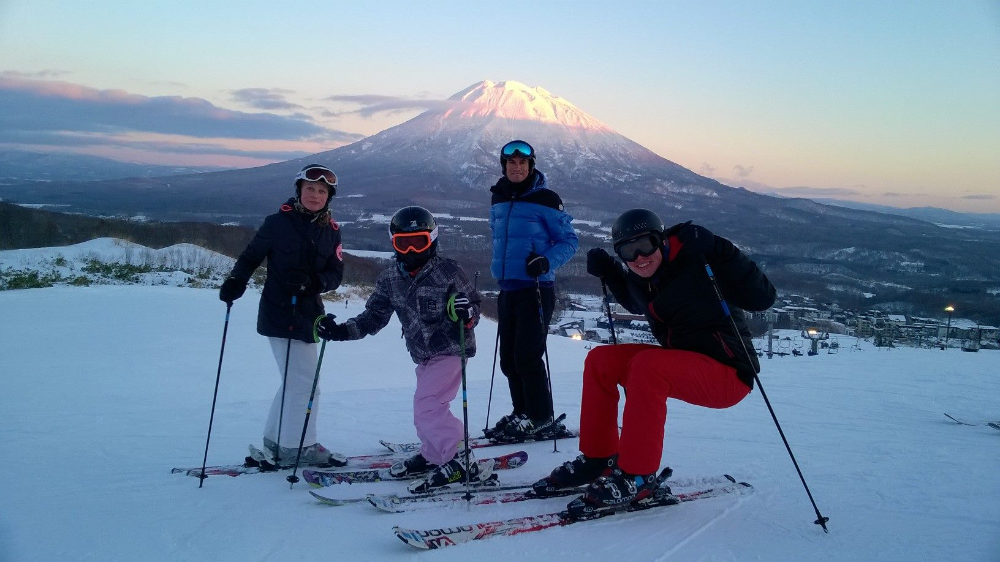
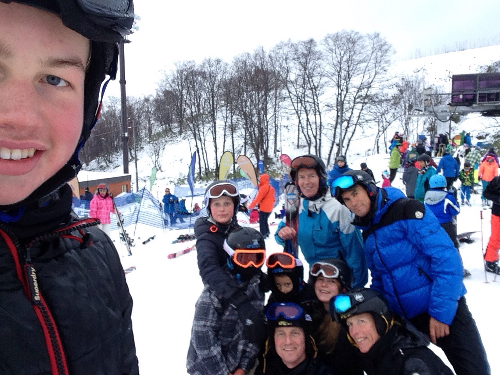
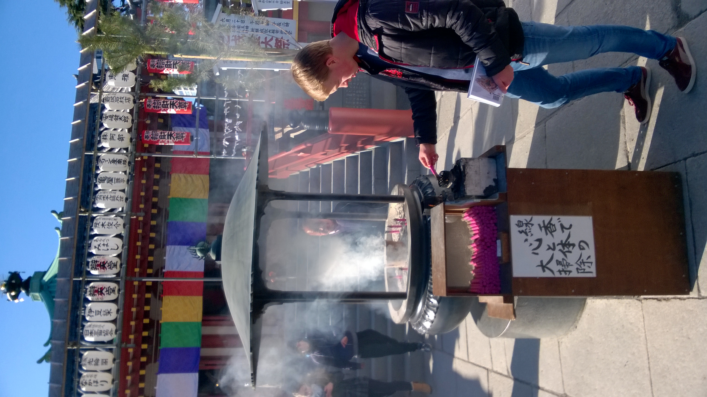
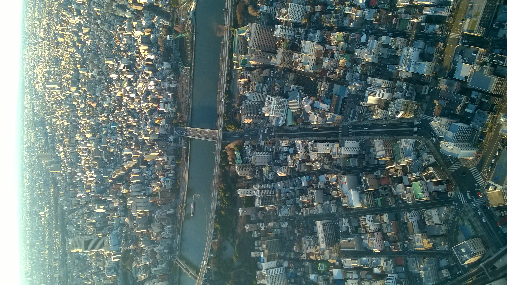

(Japan)=
# Japan

Japan is a fascinating blend of ancient tradition and cutting-edge modernity, known for its beautiful temples, bustling cities, and stunning natural landscapes. During our family trip, we experienced Kyoto’s famous temples, skied the snowy slopes of Niseko, and explored Tokyo’s vibrant city life, including a meaningful visit to Hiroshima.

- 👨‍👩‍👧‍👧 Trip type: Family (Anthony, Ilse, Kim, Niels, Anke)
- 🗓️ Duration: 2 weeks (2015)
- 📍 Highlights: Kyoto, Niseko, Tokyo

## Kyoto
While based in Kyoto, Japan, our family had a wonderful experience exploring two of the city’s most famous temples: Kinkaku-ji, the Golden Pavilion, and Ginkaku-ji, the Silver Pavilion. At Kinkaku-ji, we were amazed by the brilliant gold leaf shimmering in the sunlight, perfectly reflected in the peaceful pond. At Ginkaku-ji, we enjoyed the quiet, simple beauty of the gardens and the calming atmosphere. Experiencing these two contrasting styles of Japanese culture and history together as a family was truly memorable.

```{figure} Figures/Japan_temple.JPG
---
name: Kinkakuji
align: center
width: 70%
---
Our family at Kinkaku-ji
```

## Skiing in Niseko
We went skiing in Niseko, Hokkaido. I wasn’t aware you could ski in Japan before this trip. The snow was amazing and the runs were fun to explore. We had a great view of a vulcano while on the slopes.

<div style="display: flex; justify-content: space-around;">
  <figure style="text-align: center; width: 45%;">
    
    <figcaption>Skiing in Niseko with vulcano in the background</figcaption>
  </figure>
  <figure style="text-align: center; width: 45%;">
    
    <figcaption>Selfie with the family Helmantel</figcaption>
  </figure>
</div>

## Tokyo
During our holiday we visited Tokyo, where we enjoyed exploring the city’s incredible blend of modern skyscrapers and lively streets illuminated by neon lights. One highlight was visiting Kawasaki Daishi Heiken-ji Temple nearby, where we experienced the traditional hatsumōde ritual, surrounded by colorful banners and the scent of burning incense. This peaceful temple visit offered a beautiful contrast to Tokyo’s bustling energy and was a perfect way to welcome the new year. We also took a day trip on the Shinkansen bullet train to Hiroshima, the train was impressively fast and smooth, and visiting the Atomic Bomb Memorial there was a powerful, moving experience that left a deep impression on me.

<div style="display: flex; justify-content: space-around;">
  <figure style="text-align: center; width: 45%;">
    
    <figcaption> Lighting a candle at the Kawasaki Daishi Heiken-ji Temple</figcaption>
  </figure>
  <figure style="text-align: center; width: 45%;">
    
    <figcaption>Tokyo skyline</figcaption>
  </figure>
</div>