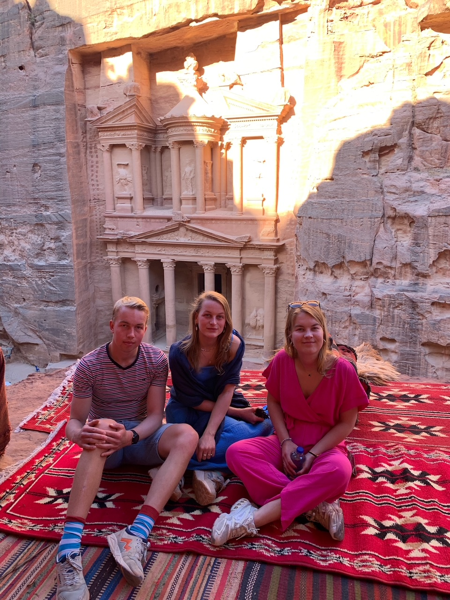
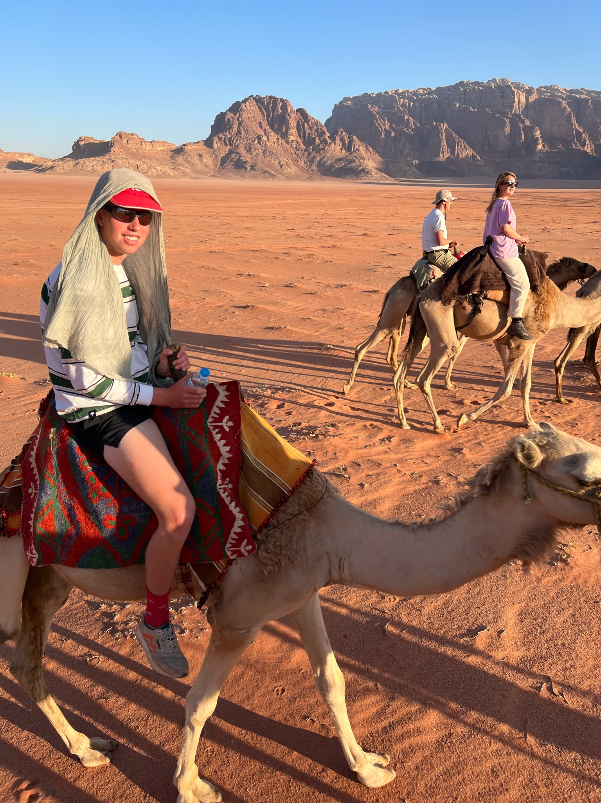
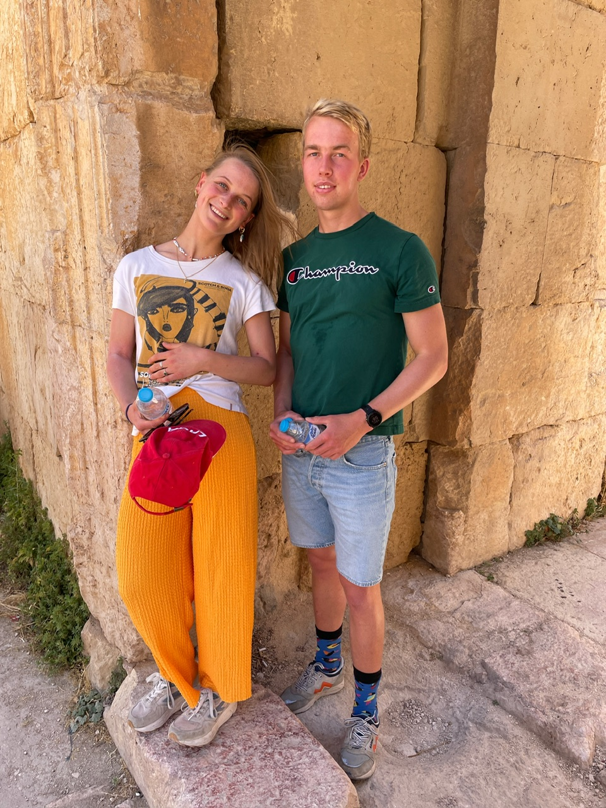

(Jordan)=
# Jordan

Jordan is a beautiful country in the Middle East known for its ancient ruins, desert landscapes, and warm hospitality. During our trip, we explored some of the country's most iconic sites — from the red-rose city of Petra to the vast Wadirum desert and the Roman ruins of Jerash.

- 👨‍👩‍👧‍👧 Trip type: Family
- 🗓️ Duration: 7 days (2023-10-21 to 2023-10-27)
- 📍 Highlights: Petra, Wadirum, Jerash

## Petra

  

    <h3>Petra</h3>
    

      Petra, also known as the "Rose City," is a UNESCO World Heritage Site carved into pink sandstone cliffs. It was once a thriving Nabatean trading hub and is now one of the New Seven Wonders of the World. The walk through the narrow Siq to the Treasury is an unforgettable experience.
    

  

  

    
    
<em>Me with my sisters in Petra</em>

  

## Wadirum

  

    
    
<em>Me riding a camel in the Wadirum desert</em>

  

  

    <h3>Wadirum</h3>
    

      Wadirum, also called the "Valley of the Moon," is a dramatic desert landscape of red sand and towering rock formations. We explored the area by jeep and camel, and stayed overnight under the stars in a Bedouin-style camp — truly magical.
    

  

## Jerash

  

    <h3>Jerash</h3>
    

      Jerash is one of the best-preserved Roman cities outside Italy. Its colonnaded streets, temples, and theaters reveal the scale and grandeur of ancient urban life. Walking through the Temple of Artemis and the forum was like stepping back in time.
    

  

  

    
    
<em>Me with my sister Anke at the temples of Jerash</em>

  

