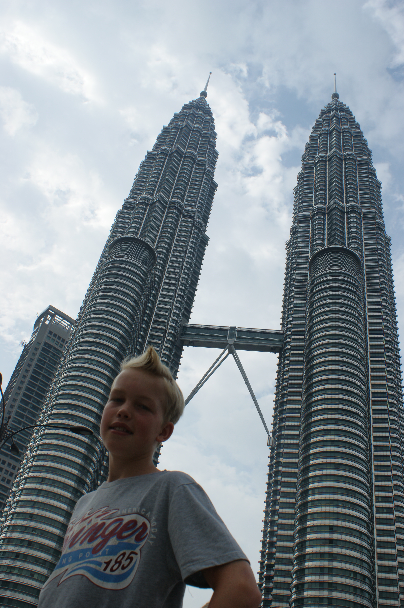
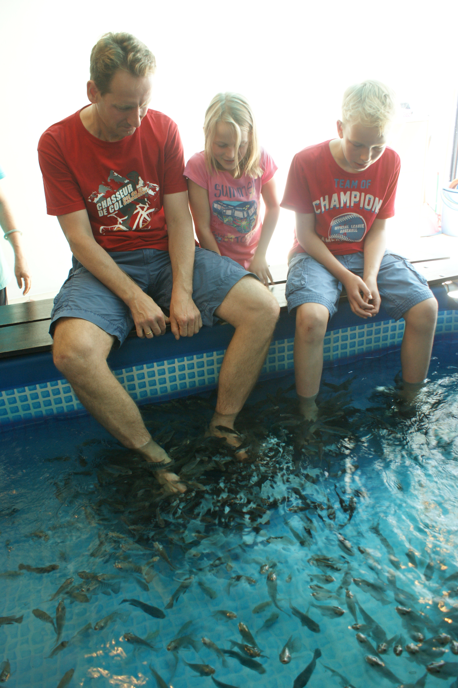
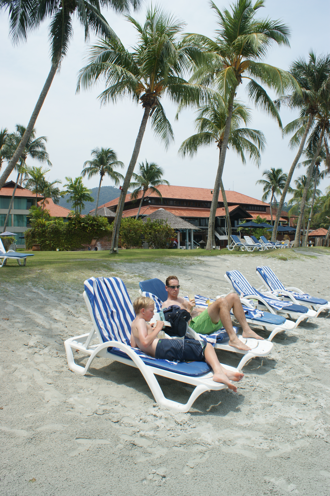
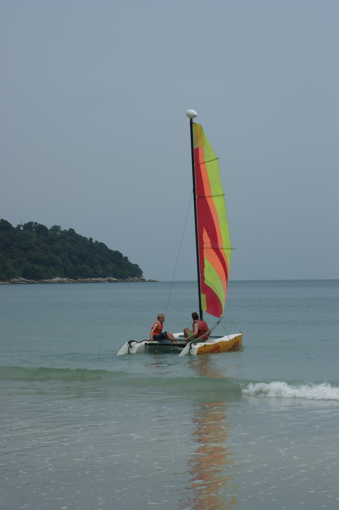

(Malaysia)=
# Malaysia

Malaysia, a vibrant country known for its diverse culture and modern cities, was our destination in 2012. We spent a few days in Kuala Lumpur to rest and recover from jetlag before heading to [Australia](Australia) to visit family. The trip was a nice mix of city exploration and relaxing beach resort time.

- 👨‍👩‍👧‍👧 Trip type: Family (Anthony, Ilse, Kim, Niels, Anke)
- 🗓️ Duration: 2012
- 📍 Highlights: Kuala Lumpur, Resort

## Kuala Lumpur
We explored Kuala Lumpur’s iconic landmarks, especially the Petronas Towers, which fascinated me as a future engineer with an interest in structural design and innovative architecture. Alongside sightseeing, we enjoyed unique local experiences like the fish foot bath.

  <figure style="text-align: center; width: 30%;">
    
    <figcaption>Petronas Towers</figcaption>
  </figure>
  <figure style="text-align: center; width: 30%;">
    
    <figcaption>Foot in a bath with fish</figcaption>
  </figure>

## Resort
After the city, we relaxed at a beautiful beach resort, spending peaceful days by the sea and enjoying sailing adventures—a perfect way to unwind and recharge before continuing our travels.

  <figure style="text-align: center; width: 30%;">
    
    <figcaption>Beach at resort</figcaption>
  </figure>
  <figure style="text-align: center; width: 30%;">
    
    <figcaption>Sailing at resort</figcaption>
  </figure>

