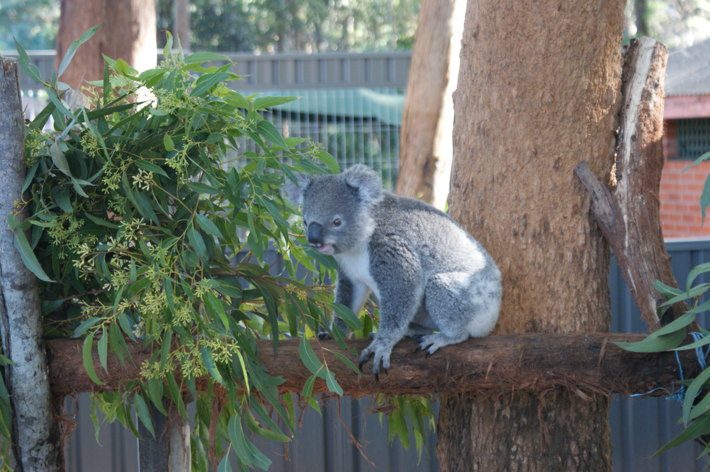
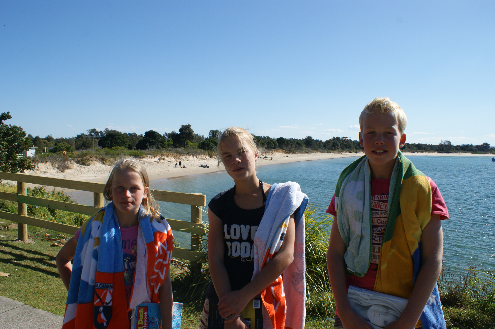
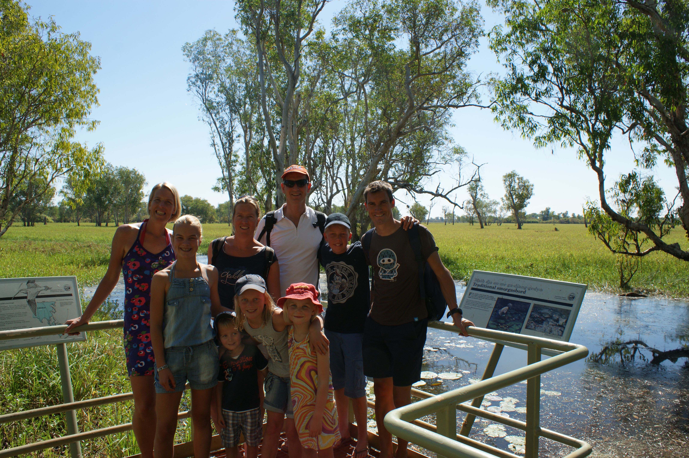
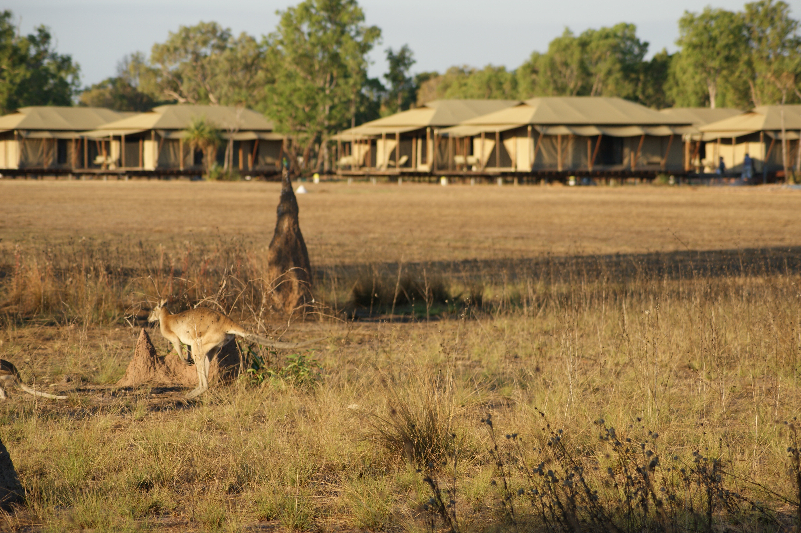
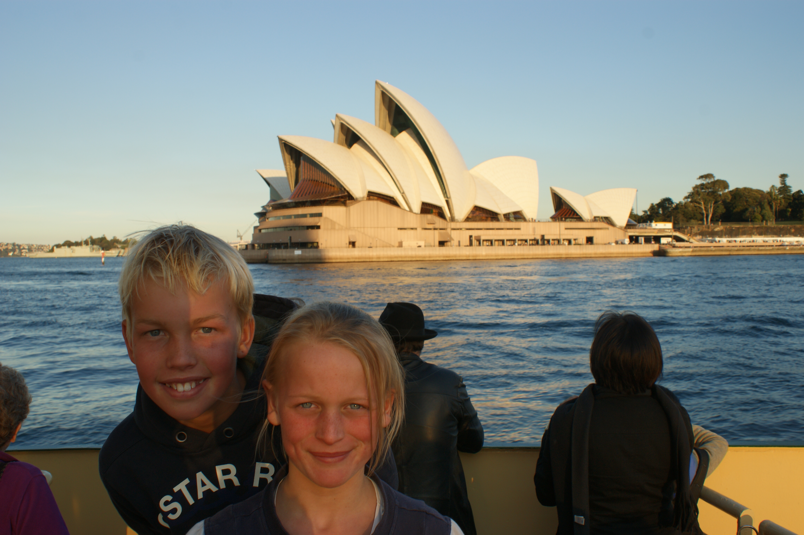
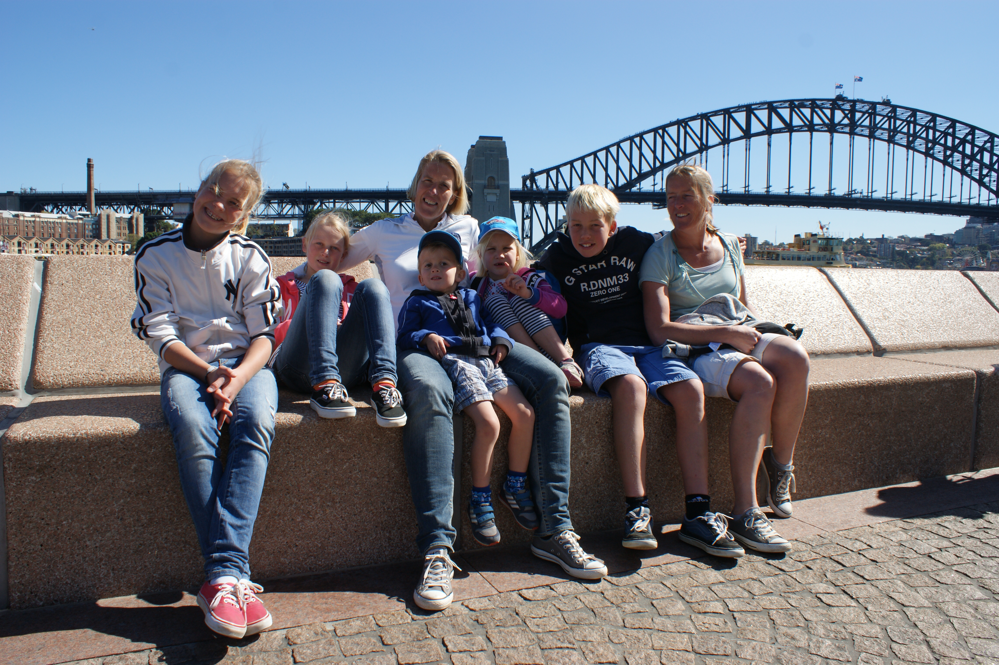
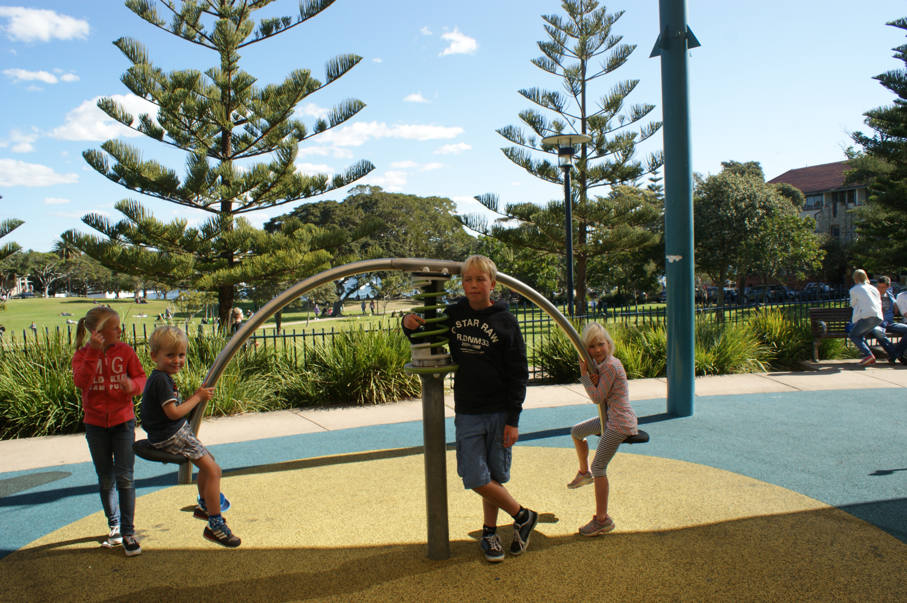
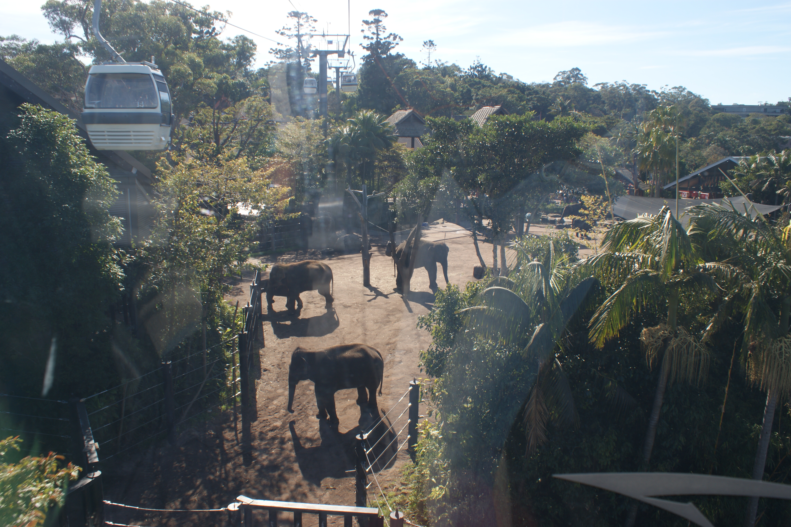
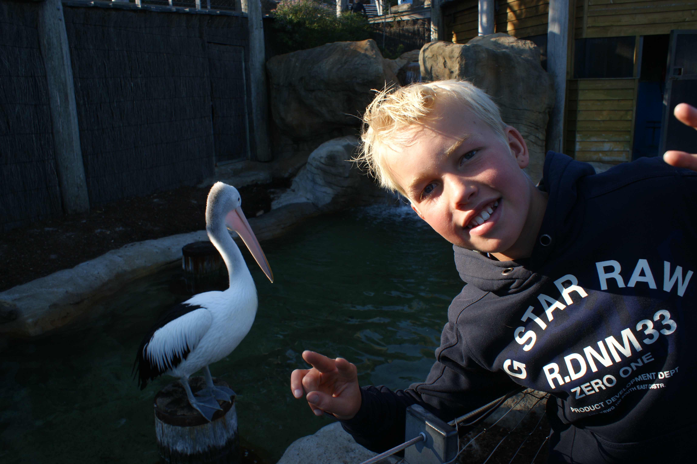
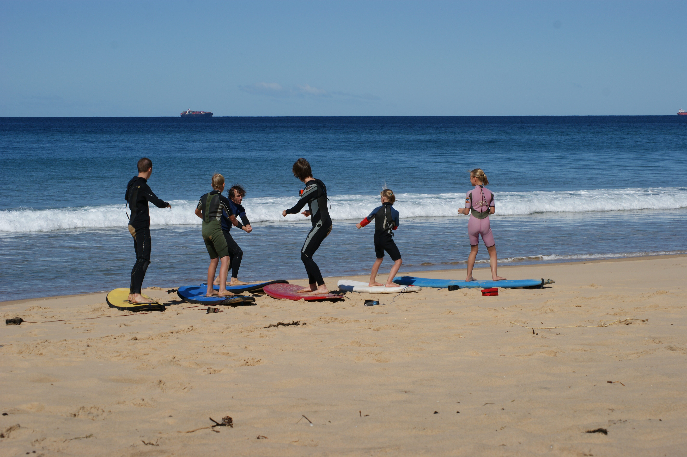

(Australia)=
## Australia
Australia, the world’s largest island and smallest continent, is known for its unique wildlife, stunning coastlines, and vibrant cities. In 2012, our family traveled here to meet relatives in Sydney and embark on a diverse adventur, from road-tripping along the East Coast to exploring the tropical Top End and enjoying time with family.

- 👨‍👩‍👧‍👧 Trip type: Family (Anthony, Ilse, Kim, Niels, Anke)
- 🗓️ Duration: 2012
- 📍 Highlights: Roadtrip camper, Darwin, Sydney

```{figure} Figures/Australia_BondiBeach.JPG
---
name: bondibeachfamily
align: center
width: 70%
---
Family picture with Helmantel family at Bondi Beach
```

## Roadtrip Sydney to Brisbane by camper
We began our journey with a scenic road trip along Australia’s East Coast in a camper van. Traveling from Sydney to Brisbane, we enjoyed coastal views, visited sandy beaches, and a koala hospital.

<table style="width: 100%; table-layout: fixed;">
  <tr>
    <td style="width: 33.33%;"></td>
    <td style="width: 33.33%;"></td>
    <td style="width: 33.33%;"></td>
  </tr>
</table>

## Darwin and mainland
After our coastal adventure, we flew to Darwin in the Northern Territory to reconnect with family and explore the region. We wandered through the tropical city, then ventured inland to the Wildman Wilderness Lodge, where we spotted kangaroos near our tent camp and experienced the beauty of the Australian outback.

<div style="display: flex; justify-content: space-around;">
  <figure style="text-align: center; width: 30%;">
    
    <figcaption>Darwin with family Helmantel</figcaption>
  </figure>
  <figure style="text-align: center; width: 30%;">
    
    <figcaption>Kangaroo near our tent camp</figcaption>
  </figure>
</div>

## Sydney
Back in Sydney, we immersed ourselves in the city’s landmarks, walking across the Sydney Harbour Bridge, visiting the Opera House, and enjoying a day at Taronga Zoo with a gondola ride offering sweeping harbour views, after getting their with the boat. We explored local parks where Fleur and Morris could play, and even tried surfing, making the most of our time with family in this vibrant city.

<table style="width: 100%; table-layout: fixed;">
  <tr>
    <td style="width: 33.33%;"></td>
    <td style="width: 33.33%;"></td>
    <td style="width: 33.33%;"></td>
  </tr>
  <tr>
    <td style="width: 33.33%;"></td>
    <td style="width: 33.33%;"></td>
    <td style="width: 33.33%;"></td>
  </tr>
</table>